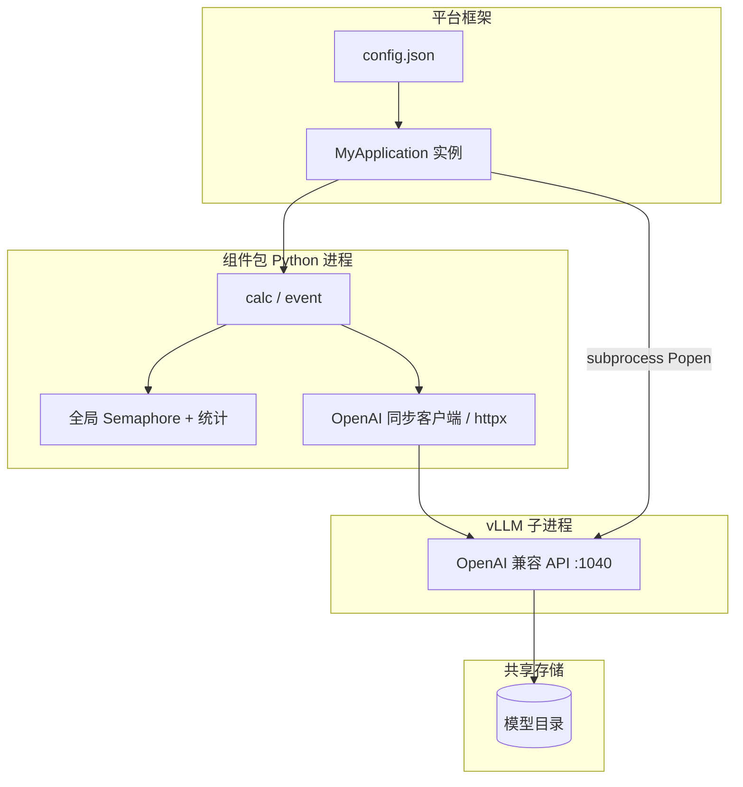

# qwen_vllm_async_copilot

面向 **MEP / SEMTP** 等平台的 **Python 代码组件包**：在推理容器内 **拉起本地 vLLM（OpenAI 兼容 API）**，对 **Qwen2.5-VL / Qwen3-VL** 等多模态模型做推理适配。
**权重文件不放在本仓库**：需按平台规范单独准备 **模型包**，通过共享存储与环境变量与本组件包 **联动**。

---

## 这是组件包还是模型包？

按 MEP 文档约定：

| 类型 | 职责 | 本仓库 |
|------|------|--------|
| **模型包** | 存放推理用 **模型参数/权重**（如 HuggingFace 格式目录），目录结构一般为 `modelDir/meta`、`modelDir/model`、`modelDir/data` 等 | **不是**。权重由平台挂载到 SFS 等路径 |
| **代码组件包** | 存放 **`config.json`、入口 Python（如 `process_sync.py`）** 等，实现 `load` / `calc` / `event` / `health`，在 `calc` 中处理业务请求 | **是** |

因此：部署时需要 **「本组件包 zip」+「模型包（含 Qwen 权重目录）」** 两套产物配合配置；本目录解决的是 **代码与 vLLM 编排**，不是模型文件打包。

---

## 工程架构（面向二次开发）

本节结合仓库代码说明 **本组件包在 MEP / SEMTP 类平台上的工程形态**，便于你照此结构实现 **其它模型 / 其它推理后端的组件包**（不限于 Qwen + vLLM）。

### 架构分层

从外到内可以看成四层，职责边界清晰：

1. **平台框架层**：读取 `config.json`，`import` 指定模块，实例化 `main_class`，在容器生命周期内调用 `load` / `calc` / `event` / `health`。本仓库不实现框架，只实现被加载的类。
2. **组件编排层（`MyApplication`）**：解析环境变量得到模型路径；**子进程**启动 `vllm.entrypoints.openai.api_server`；用 HTTP（`requests` 或 `OpenAI`+`httpx`）做就绪探测；在 `calc`/`event` 中把业务请求转成对本地 OpenAI 兼容端点的调用。
3. **推理服务进程（vLLM）**：独立 Python 进程，监听 `127.0.0.1:1040`，从磁盘加载 `--model` / `--tokenizer` 指向的目录（与 **模型包** 挂载路径一致）。
4. **模型与存储**：权重与配置在共享存储上，由 `MODEL_SFS`、`MODEL_OBJECT_ID`、`path_appendix` 拼出路径，**不在本仓库**。



### 代码结构说明（极简样例）

以下目录树标注了各文件/目录的 **必要程度**，供开发新组件包时参考：**只带 `★` 标记的文件是最小可运行骨架**，其余可按业务需要增删。

```
qwen_vllm_async_copilot/          # 组件包根目录（打包为 component.zip）
├── config.json                    # ★ 声明入口文件与类名，平台框架读取
├── package.json                   # ★ 平台元数据（scope/version/type/name）
├── __init__.py                    # ★ 全局环境变量定义与默认值（内嵌引擎模式必需）
│
├── process_sync.py                # ★ 子进程HTTP模式入口（MyApplication: __init__/load/calc/event/health）
├── process.py                     #   子进程HTTP模式备选入口（messages格式，与process_sync互斥）
├── application.py                 #   内嵌引擎模式入口（扫描models/目录，构建InferenceServer）
│
├── server.py                      #   内嵌引擎：推理服务器（加载/推理/统计/健康检查）
├── model.py                       #   内嵌引擎：模型基类（DiscriminativeModel / GenerativeModel）
├── factory.py                     #   内嵌引擎：ModelFactory抽象基类
├── repository.py                  #   内嵌引擎：ModelRepository（从磁盘扫描模型配置）
├── config.py                      #   内嵌引擎：ModelConfig（backend/batch_size/worker_num等）
├── context.py                     #   内嵌引擎：InferenceContext（请求/张量/延迟统计）
├── worker.py                      #   内嵌引擎：推理Worker（多进程/多线程调度）
├── ensemble.py                    #   内嵌引擎：EnsembleModel（多子模型编排）
├── error_handler.py               #   内嵌引擎：统一异常处理
├── stats.py                       #   内嵌引擎：推理延迟统计
├── message.py                     #   内嵌引擎：betterproto消息体
├── launcher.py                    #   内嵌引擎：PD分离分布式启动器
│
├── backends/                      #   推理后端实现
│   ├── vllm_backend.py            #     VllmModel（封装AsyncEngineArgs/流式生成/PD分离）
│   ├── acl_utils/                 #     昇腾ACL推理工具
│   └── bert_ft/                   #     BERT微调后端
│
├── models/                        #   内嵌引擎的ModelFactory实现（application.py自动扫描）
│   └── vllm/
│       ├── default.py             #     DefaultVllmModelFactory（通用vLLM配置）
│       ├── qwen3_vl.py            #     QwenVlModelFactory（Qwen3-VL多模态适配）
│       └── qwen3_vl_sep.py        #     QwenVlModelFactorySep（PD分离模式）
│
├── utils/                         # ★ 通用工具（日志为必需，其余按需）
│   ├── __init__.py                #     导出LOGGER
│   ├── log.py                     #   ★ 日志（优先框架logutil，回落本地文件）
│   ├── const.py                   #     常量定义
│   ├── common.py                  #     通用工具函数
│   ├── error.py                   #     错误类型
│   ├── mep_utils.py               #     MEP平台API客户端
│   ├── nsp/                       #     多模态数据获取（NSP下载图片/base64转换）
│   └── ...
│
├── common_utils/                  #   通用业务工具（HTTP/请求/状态码等）
├── common_utils1/                 #   历史工具（OBS/InternLM/安全模块，主入口未引用）
├── nsp/                           #   独立NSP SDK（与utils/nsp/功能重叠）
├── configs/vllm/                  #   vLLM配置文件（system_prompts/lookup_table）
├── images_test/                   #   探活用测试图片（子进程HTTP模式__init__中使用）
├── qa_ocr/                        #   特定业务场景（OCR/prompt构造）
├── init.sh                        #   启动脚本（确定性计算等环境设置）
├── model_config.json              #   Qwen3-VL模型HuggingFace配置（非组件包配置）
├── bounded_executor.py            #   有界线程池
├── image_fun.py                   #   图片embedding缓存管理
├── get_input_mm.py                #   多模态输入数据结构
├── tokenizer.py                   #   分词器
├── obs_download_file.py           #   OBS文件下载
├── client.py                      #   客户端工具
└── config.py                      #   配置工具（与根目录config.json不同）
```

**开发新组件包时的要点**：

1. **最小骨架** = `config.json` + `package.json` + `__init__.py` + 单一入口模块（如 `process_sync.py`）+ `utils/log.py`。其余均可按需增删。
2. **两种模式二选一**：子进程HTTP模式只需入口模块 + utils；内嵌引擎模式需 `application.py` + `server.py` + `model.py` + `factory.py` + `repository.py` + `backends/` + `models/` 整套。
3. **扩展新模型**：在内嵌引擎模式下，只需在 `models/` 下新增一个 `ModelFactory` 子类文件，`application.py` 会自动扫描加载。
4. **避免整仓复制**：`common_utils1/`、`nsp/`、`qa_ocr/` 等目录属于历史/特定业务，新组件包不应盲目带入，以免引发导入错误或包体积膨胀。

### 仓库内双轨架构

本仓库实际上包含 **两套并行的推理架构**，分别对应不同的部署模式：

| 架构 | 入口 | 推理方式 | 适用场景 |
|------|------|----------|----------|
| **子进程 HTTP 模式** | `process_sync.py` / `process.py` | `subprocess.Popen` 启动 vLLM OpenAI API Server，组件通过 `OpenAI` + `httpx` 客户端 HTTP 调用 | 当前 `config.json` 默认入口；适合需要独立推理进程、便于调试和日志分离的场景 |
| **内嵌引擎模式** | `application.py` → `server.py` → `model.py` | 通过 `ModelFactory` → `VllmModel` 直接内嵌 `vllm.AsyncEngineArgs`，进程内 `async generate` | 适合需要更低延迟、SSE 流式输出、PD 分离等高级特性的场景；由平台框架 `__init__.py` 中的环境变量驱动 |

**子进程 HTTP 模式** 的数据流：

```
平台 calc(req_Data) → MyApplication.calc → Semaphore 限流 → OpenAI.chat.completions.create → HTTP → vLLM 子进程 → GPU 推理
```

**内嵌引擎模式** 的数据流：

```
平台请求 → InferenceServer.inference → Model.execute → VllmModel.generate → vllm.AsyncEngine.generate → GPU 推理
```

### 目录与职责映射

| 路径 | 与主流程关系 | 说明 |
|------|----------------|------|
| **`config.json`** | **必需** | 声明 `main_file` / `main_class`，决定加载 `process_sync` 还是 `process`。 |
| **`package.json`** | 平台元数据 | `scope` / `version` / `type` / `name`，按 SEMTP 等规范填写。 |
| **`model_config.json`** | 模型元数据 | Qwen3-VL 模型的 HuggingFace 格式配置（`architectures`、`model_type`、`vision_config` 等），**不是** 组件包配置。 |
| **`process_sync.py`** | **默认主入口** | 实现 `MyApplication`：`data` 为 `prompt` + `image_list`；成功返回 `resultCode` + `result`。 |
| **`process.py`** | 可选并列入口 | 同名 `MyApplication`，`data` 为现成 `messages`；成功返回 `code` + `response`。两文件 **互不 import**。 |
| **`application.py`** | 内嵌引擎入口 | `create_inference_server` / `create_models_from_repository` 等函数，扫描 `models/` 目录下的 `ModelFactory` 实现，构建 `InferenceServer`。 |
| **`server.py`** | 推理服务器 | `SimpleInferenceServer`、`MultiModelInferenceServer`、`AsyncGenerativeInferenceServer` 等，封装模型加载、推理、统计逻辑。 |
| **`model.py`** | 模型基类与实现 | `DiscriminativeModel`、`GenerativeModel`（含 `VllmModel` 子类在 `backends/vllm_backend.py`）；定义 `initialize` / `warmup` / `execute` / `generate` 等生命周期。 |
| **`factory.py`** | 模型工厂 | `ModelFactory` 抽象基类；`create_model` 根据 `ModelRepository` 中的配置创建模型实例，支持 Ensemble 模式。 |
| **`repository.py`** | 模型仓库 | `ModelRepository` 从磁盘目录扫描 `config.json` 创建 `ModelInfo`；`MetaInfo` 解析 `meta/type.mf` 文件。 |
| **`config.py`** | 模型配置 | `ModelConfig`（继承 `OrderedDict`），定义 `name` / `version` / `backend` / `batch_size` / `worker_num` / `cuda_devices` 等；`ModelBackend` 枚举支持 `tensorrt` / `pytorch` / `vllm` / `acl` 等。 |
| **`context.py`** | 推理上下文 | `InferenceContext` 持有原始请求、输入/输出张量、延迟统计等；`GenerationContext` 用于流式生成。 |
| **`worker.py`** | 推理 Worker | `InferenceProcess`（多进程）、`InferenceThread`（多线程）、`InferenceWorker`（多模型调度），负责模型初始化与推理执行。 |
| **`ensemble.py`** | 组合模型 | `EnsembleModel` 将多个子模型按 `EnsembleStep` / `EnsembleLayer` 编排执行，支持层间张量传递。 |
| **`error_handler.py`** | 错误处理 | `init_error_handler`、`runtime_error_handler`、`invalid_response_handler`，统一异常到 `code` / `des` 响应格式。 |
| **`stats.py`** | 推理统计 | `attach_stats` 为响应附加 `latency` 字段。 |
| **`message.py`** | 消息定义 | `betterproto` 生成的请求/响应消息体（`ClusterRequest` / `RewriteRequest` 等），用于框架内部序列化。 |
| **`launcher.py`** | 分布式启动器 | `APIServerLauncher` 用于 PD 分离场景，按 YAML 配置启动多个 `vllm.entrypoints.dist_api_server` 实例。 |
| **`backends/vllm_backend.py`** | vLLM 后端 | `VllmModel`（继承 `GenerativeModel`），封装 `AsyncEngineArgs`、`VllmEngineExecutor`（含 `DisaggregateVllmEngineExecutor` PD 分离实现）、流式结果收集等。 |
| **`models/vllm/default.py`** | 默认 vLLM 工厂 | `DefaultVllmModelFactory`，从环境变量构建 `AsyncEngineArgs`，支持前缀共享、投机解码、量化、PD 分离等配置。 |
| **`models/vllm/qwen3_vl.py`** | Qwen3-VL 工厂 | `QwenVlModelFactory` + `QwenVlModel`，处理多模态数据（`mm_uuid_setter` 管理 image token 映射），支持 `generate`（异步流式）和 `generate1`（同步）。 |
| **`models/vllm/qwen3_vl_sep.py`** | Qwen3-VL 分离工厂 | `QwenVlModelFactorySep` + `QwenVlModelSep`，PD 分离模式下图片通过 `images` 参数直接传入引擎。 |
| **`__init__.py`** | 全局环境变量 | 定义所有平台环境变量（`MODEL_SFS`、`MODEL_NAME`、`VLLM_*`、`TENSOR_PARALLEL_SIZE` 等），设置 `CUDA_MODULE_LOADING=LAZY`、Ray/ZMQ 等运行时参数。 |
| **`utils/`** | **主路径使用** | `utils/__init__.py` 导出 **`LOGGER`**（来自 `utils/log.py`）；`log.py` 优先对接框架 `common.util.logutil`，否则回落到组件目录下 `log/run.log` 等。 |
| **`utils/log.py`** | 日志 | `build_loggers` 创建 `run` / `interface` / `network` 三个 `RotatingFileHandler`；优先使用框架 `common.util.logutil`；支持 `MetricLog` 指标日志。 |
| **`utils/nsp/`** | 多模态数据获取 | `get_multimodel_data.py` 从 NSP 下载图片并转 base64；`multi_data.py` 定义 `MultiModalData` 数据结构；`get_images.py` 批量下载图片。 |
| **`utils/mep_utils.py`** | MEP 平台工具 | `MepClient` 封装 MEP 平台 API 调用。 |
| **`utils/glasses_prompt_process.py`** | 眼镜端提示词 | 处理眼镜端 OCR / 坐标等特殊 prompt。 |
| **`utils/crypt.py`** | 加解密 | 对 NSP ID/Secret 等敏感信息解密。 |
| **`nsp/`** | NSP 客户端 | 独立的 NSP SDK（签名、HTTP 工具、文件工具等），与 `utils/nsp/` 功能重叠但版本不同。 |
| **`common_utils/`** | 通用业务工具 | `base_status.py`、`constants.py`、`http_utils.py`、`job_info.py`、`log_factory.py`、`mode_factory.py`、`request_utils.py`、`result_code.py` 等。 |
| **`common_utils1/`** | 历史/工具 | OBS 下载、InternLM 模型工具、安全模块（`cryptor` / `hmacutil` / `rootkey` / `workkey`）等；主入口未引用。 |
| **`image_fun.py`** | 图片缓存 | `ImageDict` 单例管理图片 embedding 缓存（带过期淘汰）；`download_all_images` 批量下载。 |
| **`get_input_mm.py`** | 多模态输入 | `MultiModalData` 类定义，支持 base64 / tensor 输入，携带 `image_grid_thw`（Qwen2-VL 特有）。 |
| **`tokenizer.py`** | 分词器 | `WordTokenizer` 按汉字/标点/英文单词分词，与 Java `BasicTokenizer` 对齐。 |
| **`obs_download_file.py`** | OBS 下载 | `get_download_file` 从 OBS 获取文件临时下载 URL。 |
| **`bounded_executor.py`** | 有界线程池 | `BoundedExecutor` 限制最大并发任务数。 |
| **`configs/vllm/`** | vLLM 配置 | `lookup_table.json`（投机解码查找表）、`system_prompts.json`（前缀共享系统提示词）。 |
| **`images_test/`** | 构造期探活 | `__init__` 内用固定相对路径图片 + `create_mm_request_body` 发探测请求；打包部署时需保证该路径在镜像/包内存在，否则会一直等待服务就绪。 |
| **`init.sh`** | 启动脚本 | 设置 `LCCL_DETERMINISTIC=true` / `HCCL_DETERMINISTIC=true`（确定性计算）。 |
| **`qa_ocr/`** | QA/OCR 业务 | `data_huashan.py`、`gen_date_prompt.py`、`xiaoyivl_nsp.py` 等，面向特定业务场景的 prompt 构造与 NSP 调用。 |

**结论（给新组件包作者）**：最小可运行骨架 = **`config.json` + 单一入口模块（含 `MyApplication`）+ 日志（如 `utils/log.py` 模式）**；其余目录可按业务删减，避免「整仓复制」造成路径与依赖混乱。

### 类契约与生命周期（与代码一一对应）

平台期望的实例接口在本仓库中的实现如下（`process_sync` 与 `process` 的类名均为 **`MyApplication`**，仅 `calc` 内解析与返回格式不同）。

| 方法 | `process_sync.py` | `process.py` |
|------|-------------------|--------------|
| **`__init__`** | 读 `MODEL_SFS` JSON、`MODEL_OBJECT_ID`、`path_appendix` 拼 `model_path`；组装 `vllm` CLI；`subprocess.Popen` 启动子进程（含日志线程与写 `/opt/huawei/log/run/vllm_server.log` 的二次启动逻辑）；循环调用 `get_mm_response` 直至探活成功；构造 `httpx.Client` + `OpenAI(base_url=...)`。 | 同上。 |
| **`load`** | 空实现 `pass`，占位兼容框架。 | 同上。 |
| **`calc` / `event`** | 校验 `req_Data` 与 `data`；`build_messages`；`_get_permits_needed` 申请多个 `Semaphore`；`_call_with_retry` → `chat.completions.create`；成功字典含 **`resultCode` / `result`**。 | 从 `data` 取 **`messages`**；槽位与重试逻辑同左；成功为 **`code: 0` / `response`**；请求里 **`model` 写死 `qwen25-vl`**。 |
| **`health`** | `return True`。 | 同上。 |

**内嵌引擎模式的生命周期**（由平台框架驱动）：

| 阶段 | 调用链 | 说明 |
|------|--------|------|
| 初始化 | `application.py` → `_inspect_factory_impl` → `ModelFactory.create_model` → `VllmModel.__init__` | 扫描 `models/` 目录，找到匹配 `MODEL_NAME` 的 `ModelFactory`，创建模型实例 |
| 模型加载 | `InferenceServer.setup` → `Model.initialize` → `VllmModel._start_engine` | 启动 vLLM AsyncEngine，加载权重到 GPU |
| 预热 | `Model.warmup` | 可选的预热推理 |
| 推理 | `InferenceServer.inference` → `Model.execute1` / `Model.generate` → `VllmModel.generate` | 同步或流式推理 |
| 健康 | `InferenceServer.health` | 检查 `_ready` 状态 |

**模块级状态（两入口文件顶部）**：`tp`、`max_num_seqs` 等从环境变量读取；`_GLOBAL_SEMAPHORE` 容量等于 `max_num_seqs`；`_GLOBAL_STATS` 在 `calc` 中更新。此类状态 **进程内全局共享**，多线程并发 `calc` 时由信号量 + 锁保证安全。

### 并发与「async」含义

- 业务侧 **async** 指平台可对 **`calc` 并发调用**；本仓库使用 **同步** `OpenAI` 客户端与 **`threading.Semaphore`**，而非 `asyncio`。
- **槽位策略**：`_count_images` 统计消息中的图数；`_get_permits_needed` 采用「每图约 2 槽位、单请求上限为 `MAX_CONCURRENT // 2`」的保守策略，与 vLLM **`--max-num-seqs`** 及显存风险对齐。
- **HTTP 连接**：`httpx.Limits(max_connections=MAX_CONCURRENT+8, max_keepalive_connections=MAX_CONCURRENT)`，读超时与 `wait_time` 环境变量相关。

### 依赖关系（导入图）

**子进程 HTTP 模式**（`process_sync.py` / `process.py`）：

```
process_sync.py
  ├── from utils import LOGGER as logger     # 统一日志出口
  ├── openai.OpenAI + httpx.Client           # 推理调用 → 127.0.0.1:1040/v1
  ├── requests.post                          # 探活路径 → chat/completions
  ├── subprocess.Popen                       # 启动 vLLM 子进程
  ├── threading.Semaphore / Lock             # 并发控制
  └── base64 / json / time / logging         # 标准库
```

**内嵌引擎模式**（`application.py` → `server.py` → `model.py`）：

```
application.py
  ├── from component import *                # 全局环境变量（__init__.py）
  ├── from component.config import ModelConfig
  ├── from component.factory import ModelFactory
  ├── from component.repository import ModelRepository
  ├── from component.server import InferenceServer
  └── importlib.import_module                # 动态扫描 models/ 目录

server.py
  ├── from component.model import ModelType
  ├── from component.context import InferenceContext
  ├── from component.worker import InferenceWorker
  └── from component.error_handler import *

model.py (VllmModel via backends/vllm_backend.py)
  ├── from vllm import AsyncEngineArgs, SamplingParams
  ├── from component.utils.nsp.get_multimodel_data import get_multimodaldata
  └── from component.image_fun import download_all_images
```

新建组件包时，建议保持 **「入口模块只依赖少量 utils + 第三方推理客户端」**，避免把未使用的 `utils/nsp`、`common_utils1` 强行打进 zip 引发 **包内相对导入或缺失 `component` 包** 问题。

### 环境变量与运行参数（编排面）

本组件包依赖大量环境变量，由平台在容器启动时注入。按功能分组如下：

**模型路径相关**：

| 变量 | 作用 | 示例 |
|------|------|------|
| `MODEL_SFS` | JSON 字符串，含 `sfsBasePath`（共享存储根路径） | `{"sfsBasePath":"/sfs/model"}` |
| `MODEL_OBJECT_ID` | 模型对象 ID（目录名） | `abc123def456` |
| `path_appendix` | 模型子目录后缀（可为空） | `` 或 `qwen3_vl` |
| `MODEL_NAME` | 模型名称（内嵌引擎模式用） | `vllm_qwen3vl` |
| `MODEL_BACKEND` | 推理后端类型 | `vllm` |
| `MODEL_ABSOLUTE_DIR` | 模型绝对路径（优先于 SFS 拼接） | `/data/model` |
| `MODEL_RELATIVE_DIR` | 模型相对路径 | `model` |

**vLLM 推理参数**：

| 变量 | 作用 | 默认值 |
|------|------|--------|
| `tp` | 张量并行 size | `1` |
| `max_num_seqs` | 最大并发序列数（与信号量对齐） | `32` |
| `max_num_batched_tokens` | 批处理 token 上限 | `8192` |
| `max_model_len` | 最大上下文长度 | `40960` |
| `gpu_memory_utilization` | GPU 显存占用比例 | `0.8` |
| `model_name` | vLLM `--served-model-name` | `qwen25-vl` |
| `wait_time` | 槽位等待 / HTTP 读超时（秒） | `120` |

**内嵌引擎模式参数**（`__init__.py` 中定义）：

| 变量 | 作用 | 默认值 |
|------|------|--------|
| `TENSOR_PARALLEL_SIZE` | 张量并行 | `1` |
| `PIPELINE_PARALLEL_SIZE` | 流水线并行 | `1` |
| `DATA_PARALLEL_SIZE` | 数据并行 | `1` |
| `GPU_MEMORY_UTILIZATION` | GPU 显存占用 | `0.9` |
| `VLLM_ENGINE_TYPE` | 引擎类型 | `default` |
| `VLLM_MAX_NUM_SEQS` | 最大序列数 | `32` |
| `VLLM_SWAP_SPACE` | 交换空间（GB） | `48` |
| `VLLM_BLOCK_SIZE` | KV Cache 块大小 | `128` |
| `VLLM_TOKENIZER_MODE` | 分词器模式 | `slow` |
| `VLLM_DISAGGREGATE_ENABLED` | 是否启用 PD 分离 | `False` |
| `VLLM_SPECULATE_TYPE` | 投机解码类型 | `` |
| `VLLM_PREFIX_SHARING_TYPE` | 前缀共享类型 | `` |
| `VLLM_QUANTIZATION` | 量化方式 | `None` |
| `VLLM_ENGINE_ROLE` | 引擎角色（P/D/M） | `M` |
| `FAST_API` | 是否使用 FastAPI | `False` |
| `SSE_RETURN` | 是否 SSE 流式返回 | `False` |

**平台框架参数**：

| 变量 | 作用 | 默认值 |
|------|------|--------|
| `BATCH_MAX_SIZE` | 最大批大小 | `1` |
| `BATCH_MAX_WAIT_LATENCY` | 批等待延迟（秒） | `0.1` |
| `FIRST_TOKEN_TIMEOUT` | 首 token 超时（秒） | `30` |
| `GENERATION_TIMEOUT` | 生成超时（秒） | `600` |
| `MAX_NEW_TOKENS_NUM` | 最大生成 token 数 | `2048` |
| `PYMEP_RELEASE` | 是否发布模式（跳过部分校验） | `False` |
| `MEP_FRAMEWORK_RUN_LOG_LEVEL` | 日志级别 | `INFO` |
| `podName` | Pod 名称（解析 group/role/instance） | `None` |

**昇腾 NPU 相关**：

| 变量 | 作用 |
|------|------|
| `HCCL_OP_EXPANSION_MODE` | 设为 `AIV`（入口模块 import 时设置） |
| `ASCEND_RT_VISIBLE_DEVICES` | 可见 NPU 设备号，默认 `0,1,2,3,4,5,6,7` |
| `VLLM_HCCL_PORT_START` | HCCL 端口起始值 | `9000` |

入口模块在 import 时还会设置 **`HCCL_OP_EXPANSION_MODE=AIV`**；`utils/__init__.py` 可设置 **`CUDA_MODULE_LOADING=LAZY`**、读取 **`PYMEP_RELEASE`**。vLLM 命令行中的 **`--dtype`、`--trust-remote-code`、`--swap-space`、JSON 形式的额外参数** 等与具体镜像/芯片绑定，新组件包替换推理后端时应整体审视，不宜盲拷。

### 已知实现细节（二次开发时建议知晓）

1. **`_wait_for_vllm_ready`**：`process_sync.py` / `process.py` 的 `_call_with_retry` 在连接被拒绝时会调用 **`self._wait_for_vllm_ready(timeout=60)`**，但类内 **未定义该方法**；仅当重试路径触发时可能 `AttributeError`。生产若依赖自愈，应补全探测逻辑或改为重启子进程。
2. **子进程启动**：`__init__` 中存在 **对同一 vLLM 命令的多次 `Popen`**（管道读日志 + 写文件各一次），可能造成 **重复监听端口** 或资源浪费；新包宜收敛为 **单一子进程 + 统一日志策略**。
3. **成功/失败响应键名**：`process_sync` 成功用 `resultCode`/`result`，失败用 `code`/`response`；调用方分支必须区分。
4. **`model_name` 环境变量 vs 硬编码**：`process_sync.py` 的 `_call_with_retry` 使用环境变量 `model_name`（默认 `qwen25-vl`），而 `process.py` 硬编码 `qwen25-vl`；切换模型时需注意两处一致性。
5. **`images_test/` 探活依赖**：`__init__` 中使用 `images_test/0ab04656875f00cc05623642dd84b2f1.jpg` 发送探测请求，打包时必须包含此目录，否则服务永远无法就绪。
6. **内嵌引擎模式的 `component` 包路径**：`model.py`、`server.py` 等文件中使用 `from component.xxx` 导入，这意味着在内嵌引擎模式下，本组件包目录需被平台框架识别为 `component` 包（即容器内的目录结构为 `component/` → 本仓库内容）。

### 新建其它组件包时可复用的「模式清单」

1. **声明入口**：`config.json` 的 `main_file`（无 `.py`）+ `main_class`。
2. **单一职责类**：`load` 可空；`calc`/`event` 做参数校验、限流、调用下游；`health` 返回 bool 或可扩展为真实探测。
3. **资源在构造期就绪**：大模型推理进程启动慢时，在 `__init__` 阻塞直到就绪，避免首包大量失败（本仓库用探活循环实现）。
4. **平台与模型解耦**：模型路径 **只来自环境变量 + 模型包目录约定**，组件 zip 不含权重。
5. **日志**：统一 `LOGGER`，文件落盘路径与平台收集方式一致；降噪 `httpx`/`openai` 日志级别（本仓库在入口模块 `logging.getLogger(...).setLevel(WARNING)`）。
6. **限流与下游一致**：本地并发上限与推理引擎的 `max batch` / `max sequences` 等配置 **数值对齐**，避免仅前端限流或仅后端限流。
7. **内嵌引擎扩展**：如需 SSE 流式、PD 分离等高级特性，可在 `models/` 下新增 `ModelFactory` 子类，由 `application.py` 自动扫描加载。
8. **环境变量驱动**：所有可配置项通过环境变量注入，避免硬编码；`__init__.py` 集中定义并设置默认值。

---

## MEP 平台组件包开发规范

本节汇总 MEP 平台对组件包的通用要求，适用于开发 **任何** 模型/后端的组件包。

### 组件包必需文件

按 MEP 文档，自定义组件包 **必须** 包含以下文件：

| 文件 | 必需 | 说明 |
|------|------|------|
| `config.json` | **是** | 声明入口文件与类名：`{"main_file": "process_sync", "main_class": "MyApplication"}` |
| 入口 Python 文件 | **是** | 如 `process_sync.py`，实现 `main_class` 指定的类 |
| `package.json` | 视平台 | 平台元数据（`scope` / `version` / `type` / `name`） |

### 类的四个方法契约

MEP 框架会按固定顺序调用组件类的方法：

```python
class MyApplication:
    def __init__(self, gpu_id=None, model_root=None):
        """构造函数。框架实例化时调用，仅一次。
        可在此完成：模型路径拼接、推理进程启动、探活等待、客户端初始化等耗时操作。"""
        pass

    def load(self):
        """加载资源。框架在构造后调用，仅一次。
        可在此完成：模型加载、耗时初始化等。也可为空实现（如本仓库）。"""
        pass

    def calc(self, req_Data):
        """推理计算。框架对每条业务请求调用，可能多线程并发。
        req_Data 为字典，业务载荷在 req_Data["data"] 中。
        返回字典，格式由业务约定。"""
        pass

    def event(self, req_Data):
        """事件接口。与 calc 等价，部分平台使用此名称。"""
        return self.calc(req_Data)

    def health(self):
        """健康检查。返回 True/False。"""
        return True
```

### 异步场景接口说明

MEP 异步场景下，业务与模型服务通过 **SFS 共享存储** 交互：

1. 业务发送 `POST /service` 请求，`data` 中包含 `taskId`、`action`（`create`/`query`）、`basePath`、`fileInfo`（图片路径等）。
2. 模型服务收到请求后异步处理，从 SFS 读取输入文件，推理后将结果写回 SFS。
3. 业务通过 `action: "query"` 查询任务状态。

**异步请求体示例**：

```json
{
    "version": "1.2",
    "meta": {
        "bId": "businessId",
        "flowId": "imageprocess",
        "uuId": "1502346942471"
    },
    "data": {
        "taskId": "100002455",
        "action": "create",
        "basePath": "/opt/business/businessId/100002455",
        "fileInfo": [
            {
                "sourceImage": "image1.png",
                "sourcePath": "/opt/business/businessId/100002455/sourcepath",
                "generatePath": "/opt/business/businessId/100002455/generatePath",
                "processSpec": []
            }
        ]
    }
}
```

**异步响应体**：成功时 `result.code` 为 `0`，结果文件写入 `generatePath`。

### 模型包规范

模型包与组件包是 **两个独立产物**，部署时配合使用：

```
modelDir.zip
└── modelDir/
    ├── meta/
    │   └── type.mf          # 必需：Manifest-Version / Model-Type / Model-Algorithm
    ├── model/               # 必需：模型参数文件（HuggingFace 格式等）
    │   ├── config.json
    │   ├── tokenizer.json
    │   ├── model.safetensors
    │   └── ...
    └── data/                # 可选：评估数据、sample.json
```

**`type.mf` 格式**：

```
Manifest-Version: 1.0
Model-Type: python
Model-Algorithm: qwen3_vl
```

- `Model-Type` 可选值：`workflow` / `ws-workflow` / `python` / `ML` / `DL`
- `modelDir` 名称固定，不要修改
- 打包时 **不要多嵌套一层目录**（常见错误）

### 打包规范

1. **组件包**：进入 `component/` 目录内压缩为 `component.zip`，保证 `config.json` 在 zip 根层级。
2. **模型包**：选中 `modelDir/` 下所有文件直接打包，避免多嵌套。
3. 打包后务必 **预览 zip 内容**，确认目录层级正确。

### 容器内目录结构

部署后，容器内的目录结构如下：

```
/
├── component/              # 组件包解压目录（即本仓库内容）
│   ├── config.json
│   ├── process_sync.py
│   ├── utils/
│   └── ...
├── model/                  # 模型包解压目录
│   └── <model_object_id>/
│       └── model/          # 实际模型文件
├── data/                   # 模型包 data 目录
├── log/                    # 日志目录
│   ├── run.log
│   ├── interface.log
│   └── network.log
├── service/                # 平台服务目录
└── temp/                   # 临时目录
```

**路径获取方式**：

```python
currentdir = os.path.dirname(__file__)           # /component/
parentdir = os.path.abspath(os.path.join(currentdir, os.pardir))  # /
model_path = os.path.join(parentdir, "model")    # /model/
data_path = os.path.join(parentdir, "data")      # /data/
```

### 镜像与环境适配

1. **基础镜像选择**：平台提供 CPU/GPU 基础镜像，需根据推理框架选择。
2. **依赖安装**：
   - 少量依赖：在 `load()` 中用 `pip install` 安装 whl 文件（放入 `resource/` 目录）。
   - 大量依赖：制作自定义 Docker 镜像。
3. **昇腾 NPU 适配**：需将 `cuda` → `npu`、`torch.cuda` → `torch_npu.npu`、`torch.float16` → `torch_npu.float16`。
4. **YAML 模板**：选择业务自有的 YAML 模板（同步选 `xxx_python_sync`，异步选 `xxx_python_async`）。

---

## 组件包应包含什么（结构与内容）

### 平台侧必需/常用文件

1. **`config.json`** — 声明框架加载的入口模块与类名：

   ```json
   {
     "main_file": "process_sync",
     "main_class": "MyApplication"
   }
   ```

   即：加载 **`process_sync` 模块** 中的 **`MyApplication`** 类（对应文件一般为 `process_sync.py`，无需写 `.py` 后缀的规则以平台为准）。

2. **`package.json`**（若平台要求）— 示例：

   ```json
   {
     "scope": "semtp",
     "version": "0.0.5",
     "type": "aiexplore",
     "name": "qwen_vllm_async_copilot"
   }
   ```

3. **入口代码** — 本仓库主用 **`process_sync.py`**（与 `config.json` 一致）。另有 **`process.py`**，请求体约定不同，详见下文 **「接口与调用约定」**。

4. **依赖目录** — 如 **`utils/`**（日志、工具）、以及历史/联调用的 **`nsp/`、`common_utils*`** 等；打包时按平台说明 **在正确层级打 zip**，避免出现多一层目录导致路径找不到。

---

## 输入、输出与调用关系（总览）

本小节用「谁调你、你收什么、你回什么」概括；细节与示例仍见下文 **「接口与调用约定」** 各小节。

### 谁调用、怎么调用

| 步骤 | 行为 |
|------|------|
| 1 | 平台根据 **`config.json`** 的 **`main_file`** / **`main_class`**，在容器内加载对应 Python 模块（如 `process_sync` → `process_sync.py`）中的 **`MyApplication`**。 |
| 2 | **构造 `app = MyApplication(...)`**（通常整个生命周期 **一次**）：内部按环境变量拼 **`model_path`**，**启动本地 vLLM 子进程**（OpenAI 兼容 HTTP），并用测试请求 **探活直到就绪**。 |
| 3 | 对每条业务请求，平台调用 **`app.calc(req_Data)`** 或 **`app.event(req_Data)`**（实现上与 **`calc` 完全等价**）。可能 **多线程/多协程并发** 调用，组件内用 **全局信号量** 与 vLLM 的 **`max_num_seqs`** 对齐限流。 |
| 4 | 探活时调用 **`app.health()`**；**`load()`** 本实现为空，可按平台要求保留调用。 |

**`req_Data` 最外层**：须为可 `get` 的字典；业务载荷一律放在 **`req_Data["data"]`**。若缺少 **`data`** 或 `req_Data` 为 `None`，两入口均返回缺参类错误。

### 组件接收什么（按入口二选一）

平台 **同一时间只应启用一个入口**（由 **`config.json` → `main_file`** 决定）。两文件 **互不 `import`、无相互调用**，是并列实现。

| 入口文件 | `config.json` 典型配置 | `data` 里调用方主要提供 |
|----------|------------------------|-------------------------|
| **`process_sync.py`** | `"main_file": "process_sync"` | **`prompt`**（文本）、可选 **`image_list`**（纯 base64 或带 `data:image/...` 前缀）、可选 **`temperature`** / **`max_tokens`**。内部用 **`build_messages`** 转成 OpenAI **`messages`** 再请求 vLLM。 |
| **`process.py`** | `"main_file": "process"` | **`messages`**（已是 OpenAI Chat 格式）、可选 **`temperature`** / **`max_tokens`**。调用方需自行组好多模态 **`content`**（`text` / `image_url` 等）。API 层 **`model` 在代码中固定为 `qwen25-vl`**，一般不再从 `data` 读模型名。 |

### 组件返回什么（调用方如何解析）

| 入口 | 成功时 | 失败 / 忙 / 缺参时 |
|------|--------|---------------------|
| **`process_sync.py`** | **`resultCode`** 为字符串 **`"0000000000"`**，模型正文在 **`result`**（**列表**，通常取 **`result[0]`**），**`des`** 为 `success`。 | 使用 **`code`（数字）**、**`des`**、**`response`**；**无** **`resultCode` / `result`**。 |
| **`process.py`** | **`code` 为 `0`**，模型正文在 **`response`**（**字符串**），**`des`** 为 `success`。 | 同样为 **`code` / `des` / `response`**（与成功形态字段名一致，便于统一分支）。 |

**联调要点：** `process_sync` 存在 **成功与失败两套键名**（成功看 `resultCode` + `result`，失败看 `code` + `response`）；`process` 则 **始终**用 `code` + `des` + `response` 判断。

### 与「async」命名的关系

两入口在代码中均通过 **`httpx.Client`** 与 **`OpenAI` 同步客户端** 调用 `chat.completions.create`，**不是** Python `asyncio` / `async def` 两套实现。名称中的 **async** 多指平台侧可对 **`calc` 并发发起请求**；并发控制由进程内 **信号量 + vLLM `--max-num-seqs`** 承担。

---

## 接口与调用约定

MEP / SEMTP 等会在容器内 **加载 `config.json` 指定的模块与类**（如 `process_sync` / `MyApplication`），按约定调用实例方法。本组件的对外契约如下。

### 框架如何调起组件

| 方法 | 说明 |
|------|------|
| **`MyApplication(...)`**（构造） | 按环境变量拼 `model_path`，**启动本地 vLLM 子进程**并探测就绪。业务前仅执行一次。 |
| **`load()`** | 本实现为空，可按平台需要保留。 |
| **`calc(req_Data)`** | **单条业务请求**的主入口；平台侧可能 **多线程/多协程并发** 调用。 |
| **`event(req_Data)`** | 与 **`calc` 完全等价**，仅名称不同。 |
| **`health()`** | 健康检查，返回 `True` 即视为存活。 |

**典型使用顺序（与平台实现细节可能略有差异，以平台文档为准）：**

1. 容器启动后，由框架根据 **`config.json`** 执行 **`from process_sync import MyApplication`**（或等价方式），**构造 `app = MyApplication(...)`**（此时会拉起 vLLM 子进程并等待就绪）。
2. 可选：调用 **`app.load()`**（本实现为空，可保留接口）。
3. 对每条业务请求，框架调用 **`app.calc(req_Data)`** 或 **`app.event(req_Data)`**（两者等价），传入的 **`req_Data` 最外层需含 `data`，结构见下节与各入口说明**。
4. 探活/负载均衡时调用 **`app.health()`**。

**伪代码：**

```text
app = MyApplication()           # 一次
# ...
out = app.calc({"data": {"prompt": "你好", "max_tokens": 256}})   # 多次并发
# 根据 out 中的 resultCode 或 code 解析成功/失败
```

并发侧：两条入口均在进程内用 **全局信号量** 限制总并发，上限与 **`max_num_seqs`（默认 32）** 及 vLLM 的 `--max-num-seqs` 对齐；多图请求会按图片数申请 **多个槽位**（单请求最多约一半上限），避免单请求占满 GPU。

---

### 请求体最外层形态（两入口相同）

- 框架传入的 **`req_Data`** 须为可 `get` 的字典类对象。
- 业务载荷一律放在 **`req_Data["data"]`** 中；若 `req_Data` 为 `None` 或没有 **`data`**，会返回缺参类错误（见各入口的 `code` / 字段说明）。

---

### 入口一：`process_sync.py`（`config.json` 默认 `main_file`）

本入口对 **`calc(req_Data)`** / **`event(req_Data)`** 的约定：框架传入的 **`req_Data`** 为可 `get` 的字典；**业务字段必须放在 `req_Data["data"]` 中**。`req_Data` 上其它键（如 traceId、业务 ID）若存在，**当前实现不会读取**，仅作上游自行携带用。

#### 最外层 `req_Data` 长什么样

仅 **`data` 为必需**；与下游推理相关的字段都写在 `data` 里。

**仅文本（无图）示例：**

```json
{
  "data": {
    "prompt": "请用两三句话介绍你自己。",
    "temperature": 0.7,
    "max_tokens": 512
  }
}
```

**多模态（文本 + 多张图）示例：** `image_list` 中每项为 **纯 base64 字符串**，或已带 `data:image/...;base64,` 前缀的完整 data URL（代码会兼容两种写法）。

```json
{
  "data": {
    "prompt": "请详细描述这些图片中的主要内容。",
    "image_list": [
      "iVBORw0KGgoAAAANS...",
      "/9j/4AAQSkZJRgABAQ..."
    ],
    "temperature": 0.7,
    "max_tokens": 512
  }
}
```

#### `data` 内各字段说明

| 字段 | 是否必填 | 说明 |
|------|----------|------|
| **`prompt`** | 建议有 | 用户文本；可为空串，与图片组合使用。 |
| **`image_list`** | 否 | 元素为 **纯 base64** 或已带 `data:image/...;base64,` 前缀的字符串；内部会转成多模态 `image_url` 并拼进 OpenAI 格式的 `messages`。 |
| **`temperature`** | 否 | 默认 `0.7`。 |
| **`max_tokens`** | 否 | 默认 `512`。 |

内部通过 **`build_messages(data)`** 将上述字段转为标准 **`messages`** 再调 vLLM，调用方**无需**自行组装完整 `messages`（除非改代码）。

#### 成功时返回长什么样

推理走通时，返回 **成功形态**（注意 **`resultCode` 是字符串，十个 `0`**；模型回复在 **`result` 列表里，本实现一般为长度 1，正文取 `result[0]`**）：

```json
{
  "resultCode": "0000000000",
  "des": "success",
  "result": [
    "从图片中可以看到：画面左侧有一栋浅灰色多层建筑，前方为人行道，右侧有树木与车辆，整体光线明亮。"
  ]
}
```

纯文本任务时结构相同，仅 `result[0]` 为整段纯文本，例如：

```json
{
  "resultCode": "0000000000",
  "des": "success",
  "result": [
    "你好！我是通义千问，可以协助你完成写作、问答、代码等任务。有什么可以帮你的吗？"
  ]
}
```

#### 失败 / 忙 / 缺参时返回长什么样

与成功形态不同，下列情况使用 **`code`（数字）+ `des` + `response`**，**没有** `resultCode` / `result`：

| 场景 | 典型 `code` | 说明 |
|------|---------------|------|
| `req_Data` 为 `None`，或没有 **`data`** | **3** | 缺参，如 `"request data is missing."` / `"data is missing."` |
| 全局槽位在超时时间内未凑齐（服务忙） | **2** | `des` 常含 `server busy`；`response` 中说明需要多少槽位、请重试等 |
| 多次重试后仍连接失败、池超时等 | **2** | `des` 可能为 `connection_error` 等 |
| 多次重试后仍推理超时 | **2** | `des` 可能为 `timeout` |
| 其它 API/未知异常、重试耗尽等 | **1** | `des` 多为 `error` 等 |

**忙/资源不足示例（仅示意）：**

```json
{
  "code": 2,
  "des": "fail, server busy",
  "response": "需要4槽位，当前资源不足，请稍后重试"
}
```

**联调注意：** 同一入口存在两套键名——**成功看 `resultCode` + `result`**，**失败看 `code` + `response`**。调用方需分别判断，不要只认一种结构。

---

### 入口二：`process.py`（需在 `config.json` 中把 `main_file` 改为 `process`）

**`req_Data["data"]` 接收什么**

| 字段 | 是否必填 | 说明 |
|------|----------|------|
| **`messages`** | 是（语义上） | **已是 OpenAI Chat 格式** 的对话列表，例如 `role` + `content`；多模态时 `content` 可为数组，含 `type: "text"` / `type: "image_url"` 等，与本仓库中 **`create_mm_request_body`** 生成的内层结构一致。 |
| **`temperature`** | 否 | 默认 `0.7`（在 `_call_with_retry` 中读取）。 |
| **`max_tokens`** | 否 | 默认 `512`。 |

**注意**：`calc` 内调用 API 时 **`model` 写死为 `qwen25-vl`**（与 vLLM `--served-model-name` 一致），**不会**从 `data` 里再读 `model` 字段。若你本地用 `create_mm_request_body` 得到的是整段 HTTP body（含顶层的 `model`），可只把其中的 **`messages`、`max_tokens`、`temperature`** 放入 `data`，外层再包一层 `{"data": { ... }}` 供本入口使用。

**成功时返回**

```json
{
  "code": 0,
  "des": "success",
  "response": "模型回复的纯文本"
}
```

**常见错误类返回（字段名统一为 `code` / `des` / `response`）**

| `code` | 含义（概要） |
|--------|----------------|
| **0** | 成功。 |
| **1** | 一般 API/业务错误等。 |
| **2** | 槽位不足（忙）、连接失败、池超时、推理超时等。 |
| **3** | 请求体缺失或缺 `data`。 |

（与 `None` 判断、`acquire` 失败分支中的 `"fail, server busy"` 等文案以代码为准。）

---

### 两套入口速览

| 文件 | `data` 里主要字段 | 成功返回特征 | 与另一文件的关系 |
|------|-------------------|--------------|------------------|
| **`process_sync.py`** | `prompt`、`image_list`（可选）、`temperature`、`max_tokens` | `resultCode` 为 `"0000000000"`，结果为 **`result` 列表** | 与 **`process.py`** **无 import、无相互调用**；仅配置二选一。 |
| **`process.py`** | `messages`、可选 `temperature` / `max_tokens` | **`code` 为 `0`，文本在 `response` 字符串** | 同上。 |

若切换入口，须同步修改 **`config.json` 的 `main_file`**，并让上游按对应 **`data` 结构** 组包。

**实现差异摘要（除 `data`/返回格式外）：** `process_sync` 的 `_call_with_retry` 使用环境变量 **`model_name`** 作为请求模型名；`process.py` 在请求里写死 **`qwen25-vl`**，且在调用前会检查 **`vllm_process.poll()`** 是否已退出。二者在 **拉起 vLLM、探活、信号量、重试分支** 等其余部分大体对齐。

---

## 与模型包如何联动（核心机制）

组件包 **不**在业务代码里对权重做 `from_pretrained`（主路径如此），而是：

1. 用环境变量拼出 **模型包在共享存储上的解压路径**（与 MEP「`sfsBasePath` + 模型对象 ID + `model` 子目录」一致）。
2. 将该路径作为 vLLM 的 **`--model`** 与 **`--tokenizer`**，由 **vLLM 子进程**从磁盘加载权重与配置。

### 路径拼接（`process_sync.py` / `process.py` 中一致）

- 读取 **`MODEL_SFS`**：JSON 字符串，至少包含 **`sfsBasePath`**（共享存储上模型相关根路径）。
- 读取 **`MODEL_OBJECT_ID`**：模型在平台上的对象 ID（目录名）。
- 可选 **`path_appendix`**：若权重不在 `.../model` 根下而在子目录，则拼在末尾（可为空）。

公式：

```text
model_path = {sfsBasePath} / {MODEL_OBJECT_ID} / model / {path_appendix}
```

该 `model_path` 会传给：

```text
python -m vllm.entrypoints.openai.api_server --model <model_path> --tokenizer <model_path> ...
```

因此：**模型包解压后，必须让上述路径指向含 Qwen2.5-VL / Qwen3-VL 完整模型文件的目录**（与 vLLM 加载要求一致，如 `config.json`、`tokenizer` 与权重等）。

### 内嵌引擎模式的路径解析

在内嵌引擎模式下，路径由 `__init__.py` 中的全局变量解析：

```python
SFS_MODEL_BASE_DIR = os.path.join(
    json.loads(os.getenv('MODEL_SFS'))['sfsBasePath'],
    os.getenv('MODEL_OBJECT_ID')
)
SFS_MODEL_DIR = os.path.join(SFS_MODEL_BASE_DIR, MODEL_RELATIVE_DIR)
```

`application.py` 中的 `create_model_from_env` 函数使用 `MODEL_ABSOLUTE_DIR`（优先）或 `SFS_MODEL_DIR` 作为模型目录。

### 其它环境变量（与 vLLM 行为相关，节选）

| 变量 | 作用（默认示例） |
|------|------------------|
| `tp` | 张量并行 size |
| `max_num_seqs` | 最大并发序列数，与组件内信号量上限对齐 |
| `max_num_batched_tokens` | 批处理 token 上限 |
| `max_model_len` | 最大上下文长度 |
| `gpu_memory_utilization` | GPU 显存占用比例 |
| `model_name` | vLLM `--served-model-name`，默认如 `qwen25-vl` |
| `wait_time` | 槽位等待、HTTP 读超时等场景使用的秒数 |

平台侧还需保证：**镜像内已安装 vLLM 及 Qwen-VL 推理所需依赖**，且 **能访问挂载后的模型目录**。

---

## 运行时行为概要

1. **`MyApplication.__init__`**：根据 `model_path` **启动 vLLM 子进程**（监听如 `127.0.0.1:1040`），并用测试图请求 **探测就绪**。
2. **`calc` / `event`**：用全局 **信号量**限制并发（与多图占显存相关，按图片数申请多个 permit），通过 **OpenAI 官方客户端**调用本地 vLLM 的 `chat.completions`。**入参/出参字段** 见上文 **「接口与调用约定」**。
3. **模型文件的实际读取**：发生在 **vLLM 进程**内，对 `--model` 指向的目录进行加载。

仓库内 **`common_utils/mode_factory.py`、`utils/nsp/get_multimodel_data.py`** 等也包含基于 `MODEL_SFS` / `MODEL_OBJECT_ID` 拼路径或 `from_pretrained` 的逻辑，属于 **其它代码路径或工具**；当前 **`config.json` 指定的主流程**以 **`process_sync.py`** 为准。

---

## 新建组件包实战指南

以下步骤指导你从零创建一个 MEP 平台的 Python 组件包（以「子进程 HTTP 模式」为例）。

### 第一步：创建最小骨架

```
my_component/
├── config.json
├── package.json
├── process_sync.py
└── utils/
    ├── __init__.py
    └── log.py
```

**`config.json`**：

```json
{
  "main_file": "process_sync",
  "main_class": "MyApplication"
}
```

**`package.json`**：

```json
{
  "scope": "semtp",
  "version": "0.0.1",
  "type": "aiexplore",
  "name": "my_component"
}
```

**`utils/__init__.py`**：

```python
from utils.log import logger_run
LOGGER = logger_run
```

**`utils/log.py`**：复制本仓库的 `utils/log.py`，或使用框架提供的 `common.util.logutil`。

### 第二步：实现入口类

```python
import os
import json
import subprocess
import threading
import time
import logging
from utils import LOGGER as logger

class MyApplication:
    def __init__(self, gpu_id=None, model_root=None):
        # 1. 拼接模型路径
        tmp_str = os.environ.get("MODEL_SFS", '{"sfsBasePath":"/default"}')
        tmp_json = json.loads(tmp_str)
        model_path = os.path.join(
            tmp_json["sfsBasePath"],
            os.environ.get("MODEL_OBJECT_ID", ""),
            "model",
            os.environ.get("path_appendix", "")
        )
        logger.info(f"Model path: {model_path}")

        # 2. 启动推理进程（示例：vLLM）
        commands = [
            'python', '-m', 'vllm.entrypoints.openai.api_server',
            '--model', model_path,
            '--host', '127.0.0.1', '--port', '1040',
            '--trust-remote-code',
        ]
        self.process = subprocess.Popen(
            commands,
            stdout=subprocess.PIPE,
            stderr=subprocess.STDOUT,
            text=True
        )

        # 3. 探活等待
        import requests
        self.url = "http://127.0.0.1:1040/v1/chat/completions"
        while True:
            try:
                resp = requests.post(self.url, json={
                    "model": "my-model",
                    "messages": [{"role": "user", "content": "hello"}],
                    "max_tokens": 10
                }, timeout=30)
                if resp.status_code == 200:
                    logger.info("Service ready!")
                    break
            except Exception:
                logger.info("Waiting for service...")
                time.sleep(10)

        # 4. 初始化客户端
        from openai import OpenAI
        import httpx
        self.client = OpenAI(
            base_url="http://127.0.0.1:1040/v1",
            api_key="sk-placeholder",
            http_client=httpx.Client(timeout=httpx.Timeout(read=120))
        )

    def load(self):
        pass

    def calc(self, req_Data):
        if req_Data is None:
            return {"code": 3, "des": "request data is missing.", "response": ""}
        data = req_Data.get('data')
        if data is None:
            return {"code": 3, "des": "data is missing.", "response": ""}

        try:
            response = self.client.chat.completions.create(
                model="my-model",
                messages=data.get('messages', []),
                temperature=data.get('temperature', 0.7),
                max_tokens=data.get('max_tokens', 512),
            )
            return {"code": 0, "des": "success", "response": response.choices[0].message.content}
        except Exception as e:
            logger.error(f"API error: {e}")
            return {"code": 1, "des": "error", "response": str(e)[:500]}

    def event(self, req_Data):
        return self.calc(req_Data)

    def health(self):
        return True
```

### 第三步：本地测试

```python
# 在 process_sync.py 末尾添加（上传前注释掉）
if __name__ == "__main__":
    app = MyApplication()
    result = app.calc({
        "data": {
            "messages": [{"role": "user", "content": "你好"}],
            "max_tokens": 256
        }
    })
    print(result)
```

### 第四步：打包上传

1. 进入 `my_component/` 目录内，压缩为 `component.zip`。
2. 确保 `config.json` 在 zip 根层级（预览确认）。
3. 在 MEP 管理台上传组件包和模型包。
4. 配置服务时选择正确的 YAML 模板和资源规格。

### 第五步：联调排查

常见问题排查顺序：

1. **日志中 `Model path: ...` 是否正确** → 在容器内 `ls` 确认模型文件存在。
2. **vLLM 启动日志** → 检查端口监听、显存不足等错误。
3. **首次探测请求** → 确认 `images_test/` 目录存在（如使用探活图片）。
4. **`calc` 返回的 `code` / `resultCode`** → 区分成功/失败两套键名。
5. **环境变量** → 确认 `MODEL_SFS`、`MODEL_OBJECT_ID` 等已正确注入。

---

## 打包与联调建议

1. **组件包**：严格按 MEP「代码组件包」说明压缩（注意 **不要多嵌套一层根目录**），保证 **`config.json` 与 `process_sync.py` 相对路径正确**。
2. **模型包**：单独按平台「模型包」目录规范上传/挂载，并核对 **`MODEL_SFS`、`MODEL_OBJECT_ID`、`path_appendix`** 与真实磁盘路径一致。
3. **联调**：先看日志中的 **`Model path: ...`** 是否在容器内 `ls` 可见且为完整模型目录；再查 vLLM 启动日志与首次探测请求是否成功。

**代码注意：** 连接失败重试路径与 **`_wait_for_vllm_ready`**、重复 **`Popen`** 等实现细节已汇总在上文 **「工程架构 → 已知实现细节」**；生产若依赖该重试路径，须在类中补全就绪探测或改为与平台一致的重启策略。

---

## 版权声明

源码文件头可见：`Copyright (c) Huawei Technologies Co., Ltd.`（以各文件头为准）。
