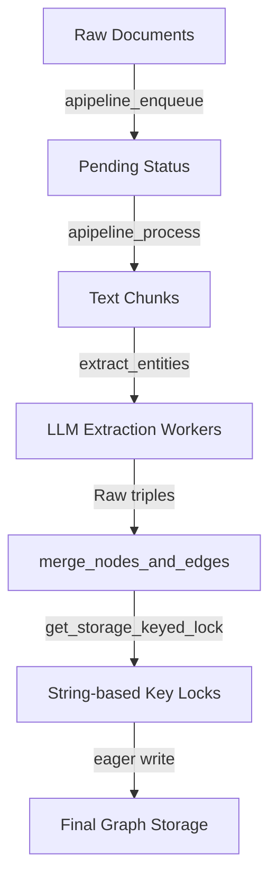

# Expert B's Vision: Uncertainty-Aware Concurrent Entity Resolution & Graph Materialization

As **Expert B**, I have analyzed the Ragent codebase—specifically the document ingestion pipeline in [`ragent.py`](file:///Volumes/SSD1/ragent/ragent/ragent.py#L1735), the concurrent locking and merging protocols in [`operate.py`](file:///Volumes/SSD1/ragent/ragent/operate.py#L3217), and the serialization log replay system in [`offline_replay.py`](file:///Volumes/SSD1/ragent/ragent/offline_replay.py#L638). 

Below is my comprehensive proposal and complete thoughts on how to transition the engineering capabilities of Ragent into a state-of-the-art research paper titled:
> **"Uncertainty-aware Concurrent Entity Resolution and Graph Materialization for LLM-extracted Knowledge Graphs"**

---

## 1. Problem Statement & Research Gap

Large Language Models (LLMs) excel at extracting semantic triples (entities and relationships) from unstructured text. However, applying this to construct a production-grade Knowledge Graph (KG) at scale introduces a core dilemma: **the tension between Write Performance (concurrency) and Graph Quality (consistency/canonicalization)**.

Currently, systems split into two extremes:
1. **Database-centric systems** (e.g., Neo4j, TigerGraph): Focus on ACID transaction concurrency, thread safety, and throughput, but treat node keys as deterministic strings (e.g., exact matches). They are oblivious to semantic duplicate names (e.g., `"OpenAI"` vs `"OpenAI Inc."` or homonyms like `"Apple"` the company vs `"Apple"` the fruit).
2. **AI-centric pipelines**: Run offline entity linking and deduplication batch jobs. These yield high-quality canonical graphs but are slow, require batch-offline processing, and fail to handle real-time, streaming, or incremental concurrent writes safely.

**The Gap**: How do we design an ingestion layer that resolves semantic entity ambiguities *on-the-fly* under high concurrency, handles extraction uncertainties probabilistically, and updates the canonical KG without causing deadlocks or semantic pollution?

---

## 2. Analysis of the Ragent Baseline & Gaps

Ragent already contains highly valuable engineering primitives, but they lack research-grade algorithms:



### Gap A: Eager & Exact String Matching (No Entity Resolution)
In [`operate.py` Line 2923](file:///Volumes/SSD1/ragent/ragent/operate.py#L2923), `_merge_nodes_then_upsert` uses the exact string extracted by the LLM as the unique key. There is no fuzzy clustering or vector-context mapping. 
* **Research Opportunity**: Transition from exact string keys to a **Mention Graph** representation where entities are clustered dynamically based on structural and semantic similarity.

### Gap B: Coarse-grained String Locking (High Contention & Skew)
In [`operate.py` Line 3284](file:///Volumes/SSD1/ragent/ragent/operate.py#L3284), `merge_nodes_and_edges` locks writes using `get_storage_keyed_lock([entity_name])`. Under a power-law distribution of real-world datasets, a few "hot" entities (e.g., `"Google"`, `"USA"`) will experience massive lock contention, stalling parallel threads.
* **Research Opportunity**: Design a **Semantic Concurrency Control (SCC)** protocol. Homonyms (different entities with the same name) should be written in parallel by splitting the lock context, while true synonyms (same entity with different names) should be resolved to the same lock dynamically.

### Gap C: Lost Extraction Uncertainty
Currently, LLM extraction errors or ambiguities (confidence levels, candidate types) are flattened into deterministic weights or merged string descriptions.
* **Research Opportunity**: Model LLM extractions as **Probabilistic Triples** in the staging layer and propagate the uncertainty into the canonical graph using calibration algorithms.

---

## 3. Proposed Architecture: The "MAGE-Ingestion" Layer

To address these gaps, we propose **MAGE (Materialization & Alignment Graph Engine)** as an ingestion layer residing between the LLM workers and the graph database.

```
       +-------------------------------+
       |    LLM Extraction Workers     |
       +-------------------------------+
                       |  (mentions & confidence)
                       v
       +-------------------------------+
       |     Staging Mention Graph     |  <-- Probabilistic log-based staging
       +-------------------------------+
                       |
                       v
  ==================== MAGE INGESTION LAYER ====================
  |                                                            |
  |  [1. Incremental Resolver]   [2. Semantic Lock Manager]    |
  |     - Vector blocking            - Homonym path splitting  |
  |     - Graph context align        - Synonym lock mapping    |
  |                                                            |
  ==============================================================
                       |
                       v  (atomic canonical updates)
       +-------------------------------+
       |     Canonical Knowledge Graph |  <-- Neo4j / NetworkX
       +-------------------------------+
```

### Module 1: Staging Mention Graph (SMG)
Instead of directly merging into the main graph, LLM workers write append-only logs of **Mentions** (nodes representing a specific text span in a specific chunk) to a Staging Mention Graph. 
* Mentions preserve the raw string, source chunk, and extraction confidence score.
* The system constructs tentative "identity edges" between mentions based on embedding similarity.

### Module 2: Incremental Entity Resolution (IER)
As new mentions flow in:
1. **Vector-based Blocking**: Quickly retrieve candidate canonical entities from the vector DB ([`entities_vdb`](file:///Volumes/SSD1/ragent/ragent/operate.py#L3220)) using mention embeddings.
2. **Context-aware Alignment**: Use the neighbors of the mention in the Staging Graph to compute context alignment scores with candidates.
3. **Decision Rule**: 
   * **Synonym Match**: Route to an existing canonical entity (e.g., `"OpenAI Inc."` -> `"OpenAI"`).
   * **New Entity**: Materialize a new canonical entity.
   * **Defer / Human-in-the-loop**: Staged as a low-confidence link if ambiguity is high.

### Module 3: Semantic Concurrency Control (SCC)
To parallelize IER and canonical updates without race conditions or performance bottleneck:
* **Synonym Lock Mapping**: When resolving `"OpenAI Inc."` to `"OpenAI"`, the writer acquires the lock for `"OpenAI"` to prevent concurrent modifications to the same canonical profile.
* **Homonym Lock Splitting**: If two incoming writes use `"Apple"`, the SCC checks their contextual embeddings. If one is "fruit" and one is "corporate", it assigns them separate semantic locks (`Apple_1` and `Apple_2`), enabling fully parallel, non-blocking ingestion.

---

## 4. Evaluation and Methodology Plan

We can validate our engine directly using Ragent's simulation and execution frameworks:

### Key Metrics
1. **Throughput & Efficiency**:
   * **TPS (Transactions Per Second)**: Average processed mentions per second under high thread limits.
   * **Lock Wait Time & Deadlock Rate**: Latency overhead introduced by concurrency control.
   * **Scalability Skew Metric**: Performance variation as entity popularity becomes highly skewed.
2. **Graph Quality**:
   * **Entity Resolution Precision & Recall (F1)**: Correctness of canonical clustering.
   * **Synonym Leakage / Duplicate Rate**: Percentage of redundant canonical nodes.
   * **Homonym Pollution Rate**: Percentage of incorrect node merges due to name collisions.

### Baselines for Comparison
* **Baseline 1 (Direct String Merge)**: The current Ragent implementation (`merge_nodes_and_edges` + exact string lock).
* **Baseline 2 (Batch Offline ER)**: Periodic offline entity resolution (very high quality, but zero real-time throughput).
* **Baseline 3 (Deterministic Key-Sharded Ingestion)**: Traditional database hashing on entity names without semantic awareness.

---

## 5. Potential Academic Impact

This work sits at the intersection of **AI systems** and **Data management**:
* For **Systems/DB researchers** (VLDB/SIGMOD), it shows how to relax traditional database locks using semantic embeddings.
* For **NLP/KG researchers** (ACL/EMNLP), it transitions entity alignment from a slow offline clustering pipeline into a real-time, transaction-safe stream.

This is a highly feasible research plan because the infrastructure is already here—we just need to replace the naive string matching and locking routines with our uncertainty-aware and semantic lock algorithms.
