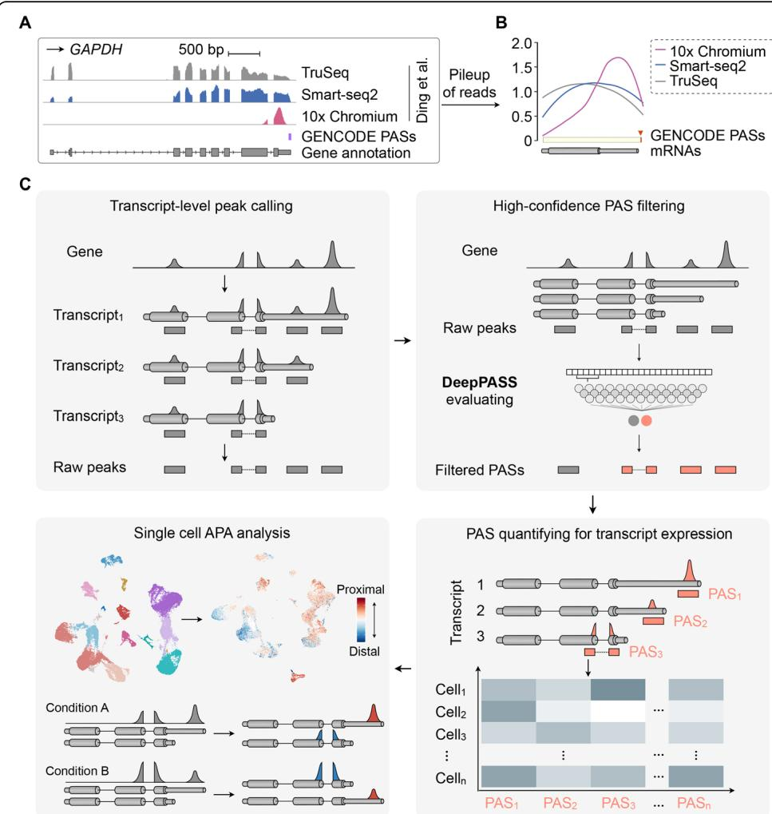
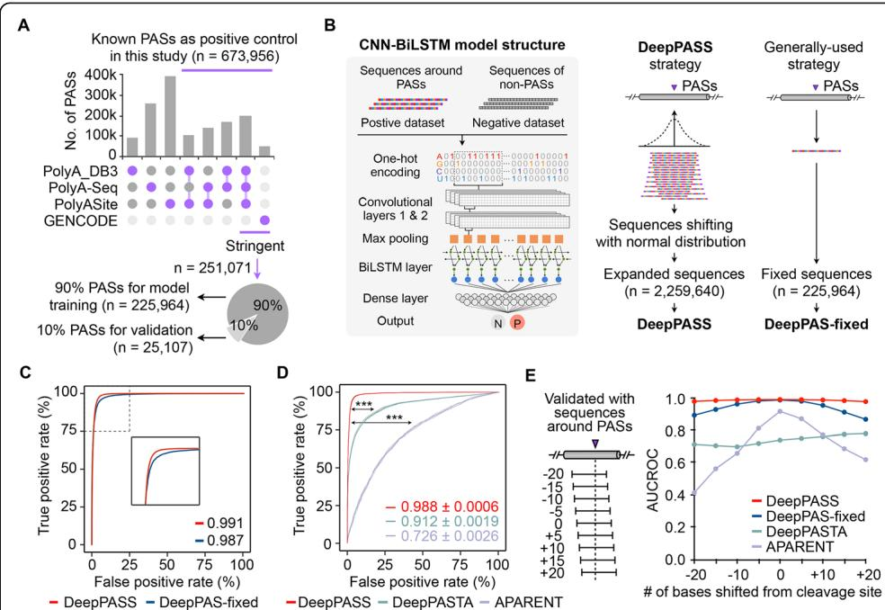

# SCAPTURE: a deep learning-embedded pipeline that captures polyadenylation information from $3 ^ { \prime }$ tag-based RNA-seq of single cells

Guo-Wei Li1† , Fang Nan1† , Guo-Hua Yuan1 , Chu-Xiao Liu2 , Xindong Liu3 , Ling-Ling Chen2,4,5, Bin Tian6 and Li Yang1 ,4\* \*D

\* Correspondence: liyang@picb.ac.

# Abstract

Single-cell RNA-seq (scRNA-seq) profiles gene expression with high resolution. Here, we develop a stepwise computational method-called SCAPTURE to identify, evaluate, and quantify cleavage and polyadenylation sites (PASs) from 3′ tag-based scRNA-seq. SCAPTURE detects PASs de novo in single cells with high sensitivity and accuracy, enabling detection of previously unannotated PASs. Quantified alternative PAS transcripts refine cell identity analysis beyond gene expression, enriching information extracted from scRNA-seq data. Using SCAPTURE, we show changes of PAS usage in PBMCs from infected versus healthy individuals at single-cell resolution.

Keywords: scRNA-seq, PAS, APA, Deep learning, Peak calling, Transcript quantification

# Introduction

The advent of single-cell RNA-seq (scRNA-seq) has enabled gene expression analysis with an unprecedented resolution [1, 2]. Based mainly on differential gene expression (DGE) [3], scRNA-seq reveals heterogeneity within a bulk of cells [4], complex tissues [5–8], or even the whole animal [9], resulting in the identification of distinct cell identities and lineage trajectories, especially in developing or differentiating systems [10, 11]. By taking advantage of machine-based cell isolation, hundreds of thousands of cells can now be individually processed for RNA enrichment and deep sequencing analysis [12, 13]. Recently, scRNA-seq technologies that use oligo(dT) priming for cDNA generation and subsequent short-read sequencing from their $3 ^ { \prime }$ -ends (herein called $3 ^ { \prime }$ tag-based scRNA-seq) [14], such as inDrops [15], Drop-seq [12], Seq-Well [16], and $1 0 \mathrm { x }$ Chromium [13], have been broadly adopted. In contrast to full-length scRNA-seq (such as Smart-seq2) and canonical bulk cell RNA-seq (such as Illumina TruSeq), these $3 ^ { \prime }$ tag-based scRNA-seq data characteristically have an enrichment of reads at the $3 ^ { \prime }$ ends of genes. For example, a comparison of transcriptome profiling in human PBMCs with TruSeq, Smart-seq2, and $1 0 \mathrm { x }$ Chromium [17] showed that a bias of mapped reads to annotated cleavage and polyadenylation sites (PASs) in the $1 0 \mathrm { x }$ Chromium data for both protein-coding (such as GAPDH, Fig. 1a, b) and noncoding (such as NORAD and GAS5, Additional file 1: Fig. S1A) genes. By contrast, TruSeq and Smart-seq2 data profile gene expression with reads covering the whole gene body (Fig. 1a, b; Additional file 1: Fig. S1B). As such, $3 ^ { \prime }$ tag-based scRNA-seq datasets can be mined for PAS identification and for expression of transcripts using specific PASs.


<!-- image_description:98eca59693075f5d9ea30721479dca24ec93c3a36a7dcec24ea279ec15434129.jpg:start -->
```image_description_start
这张图片是一幅综合性的生物信息学流程图，系统地展示了从高通量测序数据（如TruSeq、Smart-seq2、10x Chromium）中识别和分析多聚腺苷酸化位点（PolyA Sites, PASs）的完整工作流程。它由四个主要部分（A、B、C、D）构成，分别描述了数据来源、峰检测、过滤、单细胞分析及表达定量等步骤。以下是对图中所有实体和内容的详细描述：

---

## **A 部分：测序数据与基因结构可视化**

该部分展示了一个基因（GAPDH）的转录本覆盖度图谱，比较不同测序技术的数据。

- **基因示意图**：
  - 顶部标有“GAPDH”，代表一个基因。
  - 下方标注“500 bp”，表示显示的基因区域长度。
  - 基因结构用灰色矩形块表示外显子（exons），下方有虚线连接，示意内含子（introns）。
  - 最底部是“Gene annotation”（基因注释），用灰色方块表示已知外显子。

- **测序数据覆盖图**：
  - **TruSeq**：用蓝色柱状图表示，代表Illumina TruSeq文库构建方法的读段覆盖。
  - **Smart-seq2**：用深蓝色柱状图表示，代表Smart-seq2全长转录组测序方法的覆盖。
  - **10x Chromium**：用浅蓝色柱状图表示，代表10x Genomics单细胞测序平台的数据。
  - 这些柱状图高度代表在对应位置上读段的密度（pileup）。

- **PASs 标记**：
  - 用粉色三角形标记“GENCODE PASs”，代表来自GENCODE数据库的已知多聚腺苷酸化位点。
  - 粉色三角形位于基因末端附近，表明这些是已知的转录终止位点。

- **右上角引用**：“Ding et al.”，指明该图或方法可能来源于Ding等人发表的研究。

---

## **B 部分：读段堆积与PASs识别曲线**

这是一个折线图，比较不同测序技术在基因末端附近的读段堆积模式，用于识别潜在的PASs。

- **Y轴**：“Pileup of reads”，表示读段在基因位置上的累积数量。
- **X轴**：基因位置（从左到右为从5'到3'端）。
- **三条曲线**：
  - **10x Chromium**（紫色实线）：在基因末端出现明显的峰值，提示存在强PAS信号。
  - **Smart-seq2**（蓝色实线）：在末端也有峰值，但不如10x Chromium显著。
  - **TruSeq**（红色实线）：在末端几乎无明显峰值，表明其不适合检测PASs。
- **底部条形图**：
  - 显示“GENCODE PASs mRNAs”，用灰色条块表示已知mRNA的起始和终止位置。
  - 在基因末端，有黄色箭头指向“GENCODE PASs”，并与上方的读段堆积峰值对齐，说明该峰值可能对应真实PAS。

> ✅ 此部分强调了不同测序技术在PAS检测能力上的差异，其中10x Chromium和Smart-seq2更适合检测转录终止位点。

---

## **C 部分：转录本层面的峰检测与PAS过滤流程**

该部分分为两个并列模块：

### **左侧：Transcript-level peak calling（转录本水平峰检测）**

- **输入**：
  - “Gene”：基因整体转录本轮廓。
  - “Transcript₁,₂,₃”：多个不同的转录本异构体。
  - “Raw peaks”：原始读段堆积形成的峰。

- **过程**：
  - 每个转录本（Transcript₁/₂/₃）独立进行峰检测，识别出各自的潜在PAS位置。
  - 通过将原始峰与转录本结构比对，识别出每个转录本对应的剪接位点或终止位点。
  - 最终输出为每个转录本对应的“峰”（peak）位置。

### **右侧：High-confidence PAS filtering（高置信度PAS过滤）**

- **输入**：“Raw peaks”（原始峰）→ 经过“DeepPASS evaluating”（DeepPASS评估）。
  - DeepPASS 是一种基于深度学习的PAS预测模型，用于评估原始峰是否为真实的PAS。
  - 评估后保留高置信度的PAS，过滤掉低质量或假阳性峰。
  - 输出为“High-confidence PASs”，可用于后续分析。

---

## **D 部分：单细胞PAS使用分析与表达定量**

该部分聚焦于单细胞层面的PAS使用分析。

- **输入**：
  - 单细胞3′ tag-based scRNA-seq 数据（如10x Chromium）。
  - 已鉴定的高置信度PAS集合。

- **分析流程**：
  - 将每个细胞的reads映射到PAS附近区域。
  - 对每个PAS进行表达定量（如UMI计数）。
  - 构建“PAS usage matrix”：行是PAS，列是细胞，值为每个PAS在每个细胞中的表达量。

- **下游应用**：
  - 比较不同细胞类型或状态下的PAS使用偏好（APA分析）。
  - 识别与细胞命运、疾病或发育相关的动态PAS切换事件。

---

## **整体逻辑与意义**

该图系统阐述了如何利用3′端富集的单细胞RNA-seq数据（如10x Chromium）来挖掘多聚腺苷酸化位点（PASs），并进一步实现单细胞分辨率下的可变多聚腺苷酸化（Alternative Polyadenylation, APA）分析。相比传统全转录组测序（如TruSeq），3′ tag-based 方法在PAS检测上具有天然优势，而结合深度学习模型（如DeepPASS）可显著提升PAS识别的准确性。最终，该流程支持在单细胞水平研究APA的动态调控，为理解基因表达调控机制提供新视角。

> 📌 图中所展示的方法被命名为 **SCAPTURE**（Single-Cell Analysis of Polyadenylation from scRNA-seq），旨在从常规单细胞测序数据中“捕获”PAS信息，无需额外实验。
```
<!-- image_description:98eca59693075f5d9ea30721479dca24ec93c3a36a7dcec24ea279ec15434129.jpg:end -->
  
Fig. 1 Developing SCAPTURE to identify cleavage and polyadenylation sites (PASs) from 3′ tag-based scRNAseq. a Comparison of human PBMC transcriptome profiling with different deep sequencing datasets. Wiggle tracks show an enrichment of $1 0 \times$ Chromium reads (rose) at the $3 ^ { \prime }$ end of the $G A P D H$ gene locus, close to its known PAS (GENCODE), while reads of TruSeq RNA-seq (gray) and Smart-seq2 (dark blue) cover the whole gene body. Data were retrieved from published PBMC TruSeq RNA-seq, Smart-seq2, and 10x Chromium [17]. b Distribution of deep sequencing reads on mRNA genes. Pileup of deep sequencing reads from the same published datasets (a) indicates enrichment of $ 1 0 \times$ Chromium reads (rose) at $3 ^ { \prime }$ ends of genes, compared to coverage of gene bodies by TruSeq RNA-seq (gray) and Smart-seq2 (dark blue) data. The distribution of PASs on mRNA genes were annotated in GENCODE. c Schematic of a stepwise SCAPTURE pipeline for single-cell PAS calling, filtering, transcript calculating, and APA analyzing. Top left, calling peaks from 3′ tag-based scRNA-seq (the first step). Top right, identifying high-confidence PASs with an embedded deep learning neural network DeepPASS (the second step). Bottom right, quantifying PASs to represent transcript expression at a single-cell resolution (the third step). Bottom left, applying SCAPTURE to APA analysis at single-cell level (the fourth step). See “Methods” section for details

# Results

# Development of SCAPTURE for PAS analysis with $\Xi ^ { \prime }$ tag-based scRNA-seq data

To utilize $3 ^ { \prime }$ tag-based scRNA-seq data for PAS analysis, we developed a stepwise computational pipeline named scRNA-seq analysis for PAS-based transcript expression used to refine cell identities (SCAPTURE, Fig. 1c; “Methods” section). Briefly, SCAPTURE takes aligned bam files as input to call peaks that are close to PASs of genes (Fig. 1c, top left). These called peaks are then evaluated by an embedded deep learning method to select high-confidence PASs (Fig. 1c, top right). Next, selected PASs are quantified by UMItools [18] to indicate expression of transcripts according to their distinct PAS usage (Fig. 1c, bottom right). Finally, SCAPTURE identifies altered PAS usage and transcript expression among different cell types/conditions at the single-cell level (Fig. 1c, bottom left). Two features of SCAPTURE are of note. First, a deep learning neural network, named DeepPASS, is embedded in the SCAPTRUE pipeline. It is trained by selecting sequences through shifting around known PASs with stringent filtering (called stringent PASs for simplicity, “Methods” section), resulting in identification of high-confidence PASs (Fig. 2a; Additional file 1: Fig. S2A; Additional file 2: Table S1; “Methods” section). Briefly, a predicted probability ranging between 0 and 1 is obtained by the DeepPASS model for any given PAS candidate, followed by classification into a positive site group (predicted probability $> 0 . 5$ ) or a negative site group (predicted probability $\leq 0 . 5$ ) (Fig. 2b, “Methods” section). Compared with commonly used methods that are based on fixed sequences for feature extraction (termed DeepPASS-fixed here), DeepPASS achieved a higher area under curve (AUC) value with the training set (randomly selected from $9 0 \%$ of stringent PASs, “Methods” section) (Fig. 2c). As a result, by combining a convolutional neural network (CNN) and a recurrent neural network (RNN) for data training, DeepPASS achieved an AUC over 0.99 when using the validation set (the remaining, independent $1 0 \%$ of stringent PASs, “Methods” section), substantially higher than previously reported methods, such as DeepPASTA [19] and APARENT [20] (Fig. 2d; “Methods” section). Notably, this sequence selection through shifting strategy in DeepPASS can not only generate a larger training set than using fixed sequences, boosting its accuracy in PAS, but also makes predictions less sensitive to positions, increasing its sensitivity (Fig. 2e). Profiling active motifs of 128 kernels from first convolutional layer of DeepPASS showed that it was able to capture key motifs of PASs. Top captured motifs included canonical poly(A) signal AAUAAA (Entropy: 4.76) and its variants located 25 bp upstream of the cleavage site, as well as downstream U-rich motifs and the typical CA nucleotides located at the cleavage site (Additional file 1: Fig. S2B), further suggesting that DeepPASS is able to identify highconfidence PASs.

Another key feature of SCAPTURE is that the quantitative information of identified PASs is used to represent expression of transcript isoforms with distinct PASs (Fig. 1c, bottom right). It is well known that, through the alternative polyadenylation (APA) mechanism, multiple transcripts with distinct PASs (called APA transcripts) can be produced from a single-gene locus [21–23], increasing the transcriptomic complexity of the genome. Differential expression of APA transcripts has been widely examined across different cell types, but rarely at the single-cell resolution. Since different APA transcripts harbor distinct PASs, quantified PAS values can be used to represent differential transcript expression (DTE) at given gene loci. Hence, the DTE information generated by SCAPTURE can help refine cell identity analysis beyond gene expression (Fig.


<!-- image_description:ebc3192e2e850ec36e3695c44cab78af0ba9b642884e66c2e1c7a004e199d6eb.jpg:start -->
```image_description_start
结合提供的上下文文本（包括图片前后文）和LLM生成的图像描述，可以对这张科学插图进行如下全面、整合性的描述：

---

这张多面板科学插图（Fig. 2）系统展示了名为 **DeepPASS** 的深度学习模型的构建流程与性能评估，该模型旨在实现**位置不敏感**（position-insensitive）的真核生物**多聚腺苷酸化信号**（PAS）预测。研究背景指出，选择性多聚腺苷酸化（APA）可从单个基因位点产生多种转录本，显著增加转录组复杂性；而不同APA转录本携带不同的PAS，因此精确识别PAS有助于在单细胞水平解析差异转录本表达（DTE），从而超越传统基因表达层面，更精细地定义细胞身份。

插图由五个子图（A–E）组成，其中前四部分（A–D）在描述中详细展开：

### **图 A：已知PAS数据集的构建与划分**
- 研究整合了多个权威数据库（PolyA_DB3、PolyA-seq、PolyASite v2.0）以及人工校正的GENCODE注释，构建了一个包含 **673,956个已知PAS** 的正样本集合。
- 其中，同时被三个数据库或GENCODE共同注释的PAS被定义为“**Stringent PAS set**”（严格集），以确保高质量标注。
- 该数据集按 **9:1比例** 划分为训练集（n = 225,964）和验证集（n = 25,107），并通过柱状图与饼图直观展示数据来源分布与划分比例。

### **图 B：DeepPASS模型架构与增强训练策略**
- 模型采用 **CNN-BiLSTM混合架构**：
  - 输入为围绕PAS或非PAS区域的DNA序列（经one-hot编码）；
  - 通过两层卷积（Conv）和最大池化提取局部序列特征；
  - 双向LSTM（BiLSTM）捕获长程依赖与上下文信息；
  - 最终通过全连接层输出二分类概率（PAS vs. 非PAS）。
- 创新性地提出 **“DeepPASS策略”**：对原始PAS序列进行基于正态分布的随机偏移（sequence shifting），将训练数据扩充10倍（至2,259,640条），模拟生物学中PAS位置的自然变异，提升模型对位置扰动的鲁棒性。
- 对比基线方法“DeepPAS-fixed”使用固定位置序列，未进行数据增强。

### **图 C 与 D：模型性能评估（ROC曲线）**
- **图 C**（训练集）：DeepPASS（AUC = 0.991）略优于DeepPAS-fixed（AUC = 0.987），表明增强策略有效提升模型拟合能力。
- **图 D**（验证集）：DeepPASS继续保持更高AUC（具体数值虽未完整给出，但上下文暗示其泛化性能更优），证明其在未见数据上具有更强的预测稳定性与泛化能力。

---

综上，该图不仅展示了DeepPASS模型从**高质量数据构建**、**创新训练策略**到**优越性能验证**的完整技术路径，还呼应了前文提出的科学目标——通过精准量化PAS使用，实现单细胞分辨率下的APA分析，从而深化对细胞异质性和转录调控复杂性的理解。此模型为后续SCAPTURE等单细胞APA分析工具提供了关键的底层预测能力。
```
<!-- image_description:ebc3192e2e850ec36e3695c44cab78af0ba9b642884e66c2e1c7a004e199d6eb.jpg:end -->
  
Fig. 2 Constructing the embedded DeepPASS model for position-insensitive prediction of PASs. a Construction of known PAS set and stringent PAS set. Previously reported PASs in at least two databases of PolyA_DB3, PolyA-seq, and PolyASite (v2.0) or in the manually examined GENCODE annotation were combined to achieve known PAS set. Stringent PAS set was further constructed from known PASs that are annotated in all three databases or in the GENCODE annotation and was split with a 9:1 ratio between a model training set and an independent validation set for DeepPASS and DeepPAS-fixed models. b Schematic of DeepPASS construction and evaluation. Left, data processing strategy and model architecture. Middle, a sequence shifting strategy around stringent PASs was applied to construct positive training set for establishing DeepPASS model. Right, the generally used strategy with fixed sequences around stringent PASs for DeepPAS-fixed model. See “Methods” section for details. c The ROC curves of DeepPASS and DeepPAS-fixed to indicate their training performance. AUC values of DeepPASS (red) and DeepPAS-fixed (blue) were shown in plot. d The ROC curves of DeepPASS, DeepPASTA, and APARENT on the validation set. AUC values of DeepPASS (red), DeepPASTA (green), and APARENT (purple) were shown in plot from five independent validation repeats with very low standard errors. $^ { \ast \ast \ast } p < 0 . 0 0 1$ , statistical significance was assessed by Student’s t test. See “Methods” section for details. e Position-insensitive prediction of PASs with DeepPASS model. To assess positional tolerance of different models, 200-bp sequences shifting around the PASs in validation set with 5 bp stride were used to test accuracy of each model. The percentage represents true positive rate of each condition. DeepPASS (red) is more tolerant than DeepPAS-fixed (blue) and previously reported DeepPASTA (green) and APARENT (purple) models

1c, bottom right; “Methods” section). By contrast, typical scRNA-seq tools perform cell clustering by using the DGE information only [3].

# SCAPTURE for exonic PAS analysis with human PBMC scRNA-seq data

We applied SCAPTURE to profile PASs from publicly available scRNA-seq datasets of human PBMCs based on the $1 0 \mathbf x$ Genomics platform (https://support.10xgenomics. com/single-cell-gene-expression/datasets) (six datasets in total; Additional file 1: Fig. S3A, B). Of the 83,390 raw peaks called in exons, 35,378 high-confidence PASs (selected by DeepPASS with predicted probability $> 0 . 5$ ) were identified by SCAPTURE (Fig. 3a, left; Additional file 1: Fig. S4A; Additional file 3: Table S2). Among them, 29,664 $( 8 3 . 8 \% )$ ) peaks overlapped with known PASs, which were named overlapped exonic PASs. The rest were named non-overlapped exonic PASs (Fig. 3a, right; Additional