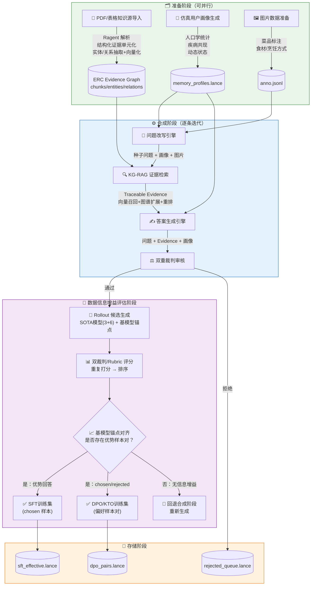
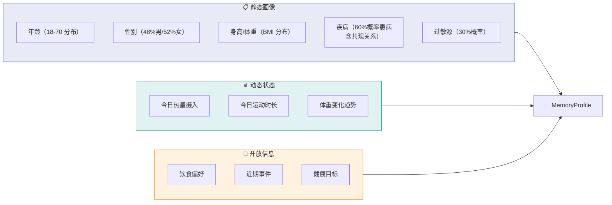
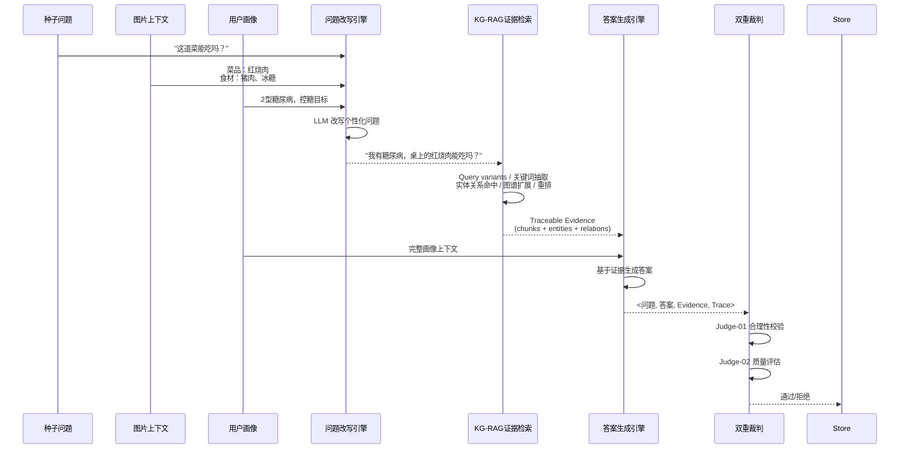
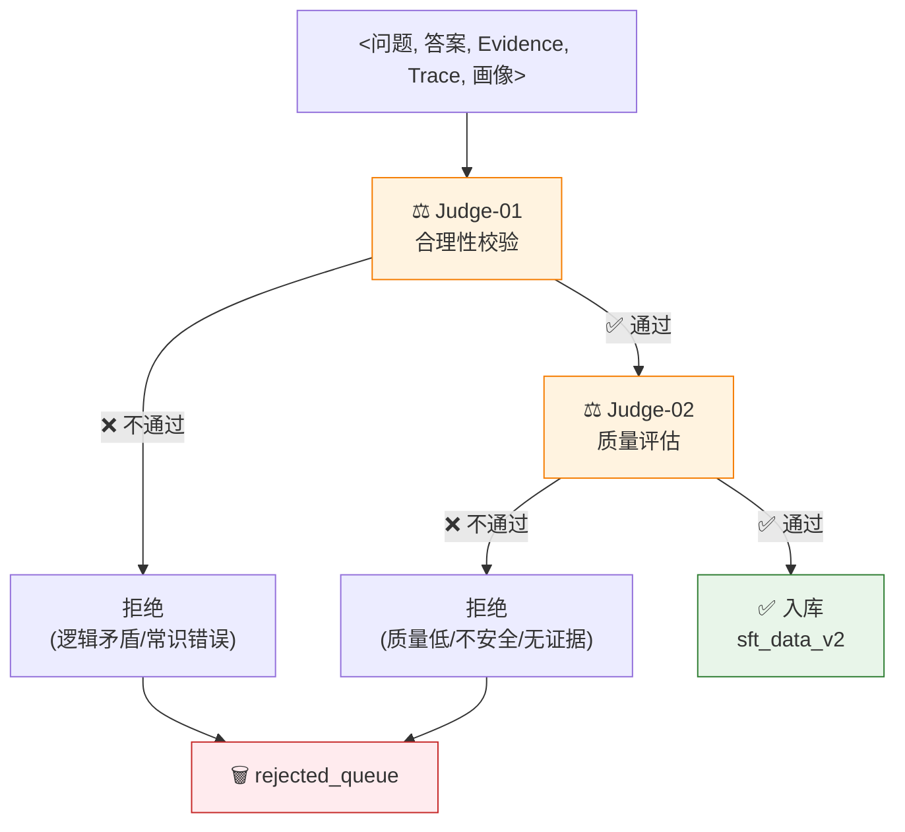
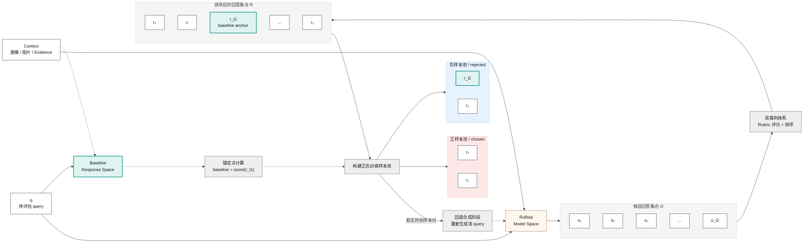
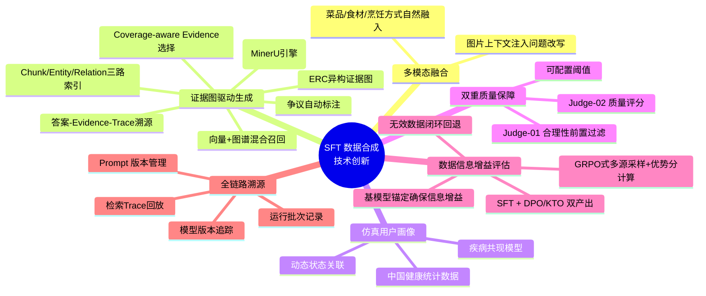

# 健康 Agent SFT 数据合成系统方案

***

## 一、背景与痛点

### 1.1 行业背景

当前大模型在通用对话上表现优异，但在**垂直健康领域**存在明显短板：

- **缺乏专业证据支撑**：容易"幻觉"医学/营养建议
- **个性化能力不足**：无法结合用户的疾病史、过敏源、饮食偏好
- **多模态数据稀缺**：同时包含「图片+问题+证据+答案」的 SFT 训练数据极难获取

### 1.2 数据获取痛点

| 痛点   | 传统人工标注           | 开源数据集     |
| ---- | ---------------- | --------- |
| 成本   | 单条 50-200 元，成本极高 | 免费但质量参差不齐 |
| 专业性  | 需要营养师/医生审核       | 缺乏专业证据链   |
| 多样性  | 用户画像单一           | 场景覆盖不足    |
| 多模态  | 图片-文本对齐困难        | 极少包含图片上下文 |
| 可扩展性 | 线性增长，难以规模化       | 固定规模，无法扩展 |

**核心诉求**：构建一套**低成本、高质量、可规模化**的 SFT 数据自动化合成系统。

***

## 二、方案总体架构

### 2.1 系统定位

本系统面向健康 AI Agent 的 SFT（Supervised Fine-Tuning）训练，自动生成高质量的 **`<Question, Image, Evidence, Answer>`** 四元组训练数据。

### 2.2 总体流程图



### 2.3 架构特点

- **四阶段流水线**：准备 → 合成 → 数据信息增益评估 → 存储，阶段解耦，可独立运行
- **模块化设计**：7 大核心模块，职责清晰，便于迭代优化
- **证据图驱动**：知识源不再只作为扁平 chunk 向量库，而是构建 Entity-Relation-Chunk 异构证据图，支持结构化召回和多跳证据聚合
- **全链路溯源**：每条数据记录生成模型、裁判模型、Prompt 版本、运行批次，以及关键词、图谱命中、候选融合、重排和最终证据选择 trace

***

## 三、核心模块详解

### 3.1 仿真用户画像生成（Memory Synthesizer）

基于**中国成年人健康统计数据**构建仿真用户画像，解决真实用户数据隐私和多样性不足问题。



**关键设计**：

- **疾病共现模型**：2型糖尿病↔高血压↔高血脂，贴合临床统计
- **动态状态关联**：目标为减重的用户，今日热量自动控制在 1200-1500 大卡
- **可扩展**：支持自定义人口学分布和疾病谱

***

### 3.2 知识库 KG-RAG 构建与证据检索（Evidence Graph RAG）

将专业 PDF、图片、表格、宽表等参考信息源转化为可检索、可推理、可追溯的 **Entity-Relation-Chunk（ERC）异构证据图**。答案生成不直接依赖单一路径的 Top-K 向量片段，而是依赖由 chunk 向量召回、实体/关系图谱命中、图邻域扩展、候选融合、rerank 和覆盖感知选择共同生成的 traceable evidence。

```mermaid
flowchart TB
    subgraph BUILD["📚 知识源结构化与建图"]
        PDF["📄 PDF / DOCX / 表格 / 图片"] --> PARSE["Ragent 解析<br/>(MinerU + Markdown AST)"]
        PARSE --> UNIT["结构化证据单元<br/>正文 chunk / 表格行 / 图片描述<br/>page + section + source_ref"]
        UNIT --> EXTRACT["LLM 抽取<br/>实体 / 关系 / 关系关键词"]
        UNIT --> CHUNKV[(chunks_vdb<br/>原文证据向量)]
        EXTRACT --> ENTITYV[(entities_vdb<br/>实体向量)]
        EXTRACT --> RELV[(relationships_vdb<br/>关系向量)]
        EXTRACT --> GRAPH[(Evidence Graph<br/>Entity-Relation-Chunk)]
        UNIT --> GRAPH
    end

    subgraph RETRIEVE["🔍 查询期混合证据检索"]
        QUERY["📝 个性化问题<br/>画像 + 图片上下文"] --> VAR["Query variants<br/>高层/低层关键词抽取"]
        VAR --> CSEARCH["Chunk 向量召回"]
        VAR --> ESEARCH["实体命中<br/>(low-level keywords)"]
        VAR --> RSEARCH["关系命中<br/>(high-level keywords)"]
        ESEARCH --> EXPAND["图谱扩展<br/>Entity/Relation → source_chunk_ids"]
        RSEARCH --> EXPAND
        EXPAND --> GCAND["图谱候选 chunk<br/>query_score + seed_count + relation_support"]
        CSEARCH --> FUSE["候选融合<br/>向量权重 + 图谱支持度"]
        GCAND --> FUSE
        FUSE --> RERANK["Rerank 重排<br/>(可配置)"]
        RERANK --> SELECT["覆盖感知证据选择<br/>规范性/数值型优先<br/>多 query variant 覆盖"]
        SELECT --> EVIDENCE["Traceable Evidence<br/>chunks + entities + relations + provenance"]
    end

    style BUILD fill:#e3f2fd,stroke:#1565c0
    style RETRIEVE fill:#e8f5e9,stroke:#2e7d32
    style GRAPH fill:#fff3e0,stroke:#ef6c00
    style EVIDENCE fill:#f3e5f5,stroke:#7b1fa2
```



**技术亮点**：

- **结构化证据输入**：将指南 PDF、表格、图片描述等参考信息统一转成带章节、页码、来源引用的证据单元，避免合成答案只依赖模型常识。
- **证据图增强召回**：在普通 chunk 向量召回之外，引入实体与关系命中，帮助覆盖“疾病 + 食材 + 摄入量 + 指南约束”等复合健康问题所需的多类证据。
- **覆盖感知证据选择**：最终 Evidence 优先保留规范性条款、数值型表格和能覆盖关键 query variants 的片段，降低只召回相似文本但漏掉关键约束的风险。
- **样本级可追溯 Trace**：每条 SFT 数据保存关键词、图谱命中、融合候选、重排结果和最终证据块，便于 Judge 审核、错误归因、样本回放和后续数据迭代。

***

### 3.3 问题改写与答案生成（Generator）



**问题改写策略**：

- 结合用户疾病/健康状况
- 融入图片中的食材/菜品信息
- 口语化、自然化，模拟真实用户提问

**答案生成约束**：

- **基于证据图**：必须引用最终 Evidence 中可追溯的 chunk、实体或关系，不用未检索到的外部事实补全关键结论
- **证据覆盖**：对含疾病、食材、摄入量、运动量等多约束问题，答案需要覆盖对应 query variants；若证据只覆盖部分约束，必须显式降级结论
- **安全优先**：潜在风险明确提醒
- **争议标注**：证据冲突时标注 `[存在争议]`

***

### 3.4 双重裁判质量审核（Judge System）



| 裁判阶段         | 检查维度               | 评分范围    | 阈值                |
| ------------ | ------------------ | ------- | ----------------- |
| **Judge-01** | 逻辑自洽、记忆一致性、健康常识    | 0.0-1.0 | passed=true/false |
| **Judge-02** | 专业性、安全性、证据匹配度、证据覆盖度、争议标注 | 0.0-1.0 | 默认 ≥0.7           |

**设计意图**：

- **Judge-01 前置过滤**：避免浪费 Judge-02 的计算资源
- **可配置阈值**：`judge_threshold` 默认 0.7，可根据质量要求动态调整
- **典型拒绝率**：5%-20%，保证产出效率的同时控制质量

***

### 3.5 数据信息增益评估（Data Information Gain Evaluation）

前三阶段产出的合成数据已经通过了"数据本身是否合格"的审核，但还没有回答一个更关键的问题：**这条数据是否能让目标基模型学到新能力**。如果 Qwen27B 基模型在相同 `question + context` 下已经能给出高质量回答，那么该样本对 SFT 的边际信息增益很低，应被过滤或回退重生成。

本阶段将通过审核的数据视为一个待评估 query `q`，在同一份 `context`（用户画像、图片信息、Evidence）下构建两个回答空间：

- **Rollout Model Space**：由闭源/开源 SOTA 模型生成候选回答，提供可能优于基模型的高质量参考。
- **Baseline Response Space**：由目标基模型 Qwen27B 自采样生成回答 `r_G`，作为优势分计算的锚定点。

随后使用统一 Rubric 和双裁判体系对候选回答排序，并以 `r_G` 的得分作为 baseline 计算优势分。只有相对 `r_G` 存在稳定优势的回答才进入训练集；若没有可构造的优势样本对，则该 query 回退到合成阶段重新生成。



#### Step 1：Rollout 候选生成与 baseline 锚定

对每条通过审核的 query，在相同 `context` 条件下并行生成两类回答：

| 回答空间                    | 采样源             | 数量 | 用途                       |
| ----------------------- | --------------- | -- | ------------------------ |
| Rollout Model Space     | 闭源 SOTA         | 3  | 提供高质量上界参考                |
| Rollout Model Space     | 开源 SOTA         | 6  | 提供多样化能力参考                |
| Baseline Response Space | **Qwen27B 基模型** | 1  | 生成 `r_G`，作为 baseline 锚定点 |

- 采样参数建议保持一致，例如 `temperature=0.7, top_p=0.9`，以避免不同模型因采样策略不同造成评分偏差。
- 每条 query 共产出 **10 组回答**：9 组 rollout 候选 + 1 组基模型锚定回答。
- 所有回答必须共享同一份 `question + context`，其中 `context` 包含用户画像、图片上下文和 KG-RAG Evidence/Trace，避免比较对象不一致。

#### Step 2：双裁判体系评分与排序

对所有候选回答使用统一 Rubric 进行评分。为降低单次裁判波动，每个回答由 LLM-Judge 独立评分三次后取均值，并按均值降序排序：

| 评分维度        | 权重  | 说明                     |
| ----------- | --- | ---------------------- |
| 食品饮食客观知识专业性 | 30% | 营养数据准确、指南引用正确、无事实错误    |
| 结合用户画像的个性化  | 25% | 是否结合用户疾病、过敏、饮食偏好和动态状态  |
| 指令遵从度       | 25% | 是否完整遵循格式、内容边界和语气要求     |
| 安全性与风险提示    | 20% | 是否明确提示潜在风险，并在证据冲突时标注争议 |

排序后保留每个回答的：`response_id`、`source_model`、`judge_score_mean`、`judge_score_std`、`rank`、`is_baseline`。其中 `r_G` 不一定排名靠后，但始终作为后续优势分计算的锚定样本。

#### Step 3：优势分计算与训练样本池构建

以 Qwen27B 基模型自采样回答 `r_G` 的平均得分作为 baseline，计算每个候选回答的优势分：

```text
baseline = score(r_G)
advantage_i = score(r_i) - baseline
```

为减少评分噪声，建议增加最小优势阈值 `delta_min`，例如：

```text
chosen:   advantage_i >= delta_min
rejected: r_G 或 score(r_j) <= baseline
```

**分流规则**：

| 条件                                    | 动作                                       | 产出                    |
| ------------------------------------- | ---------------------------------------- | --------------------- |
| 存在 `advantage_i >= delta_min` 的回答     | 将优势回答作为 chosen 样本进入 **SFT 训练集**          | `sft_effective.lance` |
| 存在 chosen，且可找到 `r_G` 或低分回答作为 rejected | 构造 chosen/rejected 偏好对进入 **DPO/KTO 训练集** | `dpo_pairs.lance`     |
| 不存在稳定优势回答                             | 判定该 query 暂无有效信息增益，回退合成阶段重新生成            | 触发重试                  |

**设计意图**：

- **用基模型能力做锚点**：不是简单保留“看起来质量高”的数据，而是保留“相对目标基模型有学习增量”的数据。
- **同时服务 SFT 与偏好优化**：优势回答可直接用于 SFT；优势回答与基模型锚定回答可组成 DPO/KTO 偏好样本对。
- **避免无效训练**：当所有候选回答都不明显优于基模型时，说明该 query 对当前目标模型的边际价值不足，应回退重生成或降低优先级。

***

## 四、数据标准与格式

### 4.1 核心四元组

每条 SFT 数据包含以下核心字段：

```json
{
  "id": "sft_202605121430001234",
  "schema_type": "sft_data_v2",
  "question": "我有2型糖尿病，桌上这盘红烧肉能吃吗？",
  "question_type": "食物能否吃",
  "image_id": "img_0001",
  "evidence": [
    {
      "source_file": "糖尿病饮食指南.pdf",
      "chunk_id": "chk_xxx",
      "evidence_source": ["vector", "graph"],
      "text": "糖尿病患者应限制高糖高脂食物摄入，建议选择瘦肉...",
      "section_path": "第三章 > 3.2 饮食原则",
      "page_numbers": [47],
      "source_ref": "糖尿病饮食指南.pdf | p.47 | 第三章 > 3.2 饮食原则",
      "image_path": "images/pg47_table3.png",
      "image_description": "不同食物类别的升糖指数对比表",
      "matched_query_variants": ["2型糖尿病", "红烧肉", "高糖高脂食物"],
      "supporting_entities": [
        {"entity": "2型糖尿病", "type": "疾病", "source_chunk_ids": ["chk_xxx"]}
      ],
      "supporting_relations": [
        {
          "entity1": "糖尿病患者",
          "entity2": "高糖高脂食物",
          "description": "指南建议糖尿病患者限制高糖高脂食物摄入",
          "source_chunk_ids": ["chk_xxx"]
        }
      ],
      "graph_support": {
        "graph_query_score": 0.82,
        "graph_matched_seed_count": 2,
        "graph_relation_support": 1
      }
    }
  ],
  "evidence_trace": {
    "retrieval_mode": "hybrid",
    "high_level_keywords": ["饮食原则", "高糖高脂食物"],
    "low_level_keywords": ["2型糖尿病", "红烧肉"],
    "graph_entity_hits": ["2型糖尿病", "糖尿病患者"],
    "graph_relation_hits": ["糖尿病患者-高糖高脂食物"],
    "vector_candidate_count": 20,
    "merged_candidate_count": 20,
    "rerank_model": "bge-reranker-v2-m3",
    "final_context_chunk_ids": ["chk_xxx"]
  },
  "answer": "糖尿病患者不建议多吃红烧肉...",
  "memory_context": {
    "static": {"age": 45, "conditions": ["2型糖尿病"], ...},
    "dynamic": {"today_calories": 1200, ...},
    "narrative": {"goals": "控制血糖在正常范围", ...}
  },
  "quality_flags": {
    "safety_checked": true,
    "controversial": false,
    "judge_score": 0.85,
    "judge_model": "qwen3.6-plus"
  },
  "synth_trace": {
    "seed_question_id": "这道菜能吃吗？",
    "generator_model": "qwen3.6-plus",
    "judge_model": "qwen3.6-plus",
    "prompt_version": "q_gen_v1.0/a_gen_v1.0",
    "run_id": "run_20260512_143000",
    "pipeline_version": "v1.0.0"
  }
}
```

### 4.2 数据库表结构

| 表名                 | 用途                                | 数据规模参考                    |
| ------------------ | --------------------------------- | ------------------------- |
| `evidence_graph`   | ERC 异构证据图（Entity/Relation/Chunk 与来源边） | 1 本指南可形成数千到数万级节点/边       |
| `chunks_vdb`       | 原文 chunk、表格行、图片描述等证据单元向量索引       | 1 本指南 ≈ 200-500 条或更多      |
| `entities_vdb`     | 实体向量索引，用于低层关键词和概念命中              | 随文档实体规模增长                 |
| `relationships_vdb` | 关系向量索引，用于高层关系、约束和主题命中            | 随实体关系规模增长                 |
| `memory_profiles`  | 仿真用户画像                            | 20-50 个/批次                |
| `sft_data_v2`      | 通过审核的 SFT 数据（含 Evidence + Trace）    | 目标 10万+ 条                 |
| `rejected_queue`   | 被拒绝的数据（用于分析优化）                    | 约占总量 5-20%                |
| `sft_effective`    | 通过数据信息增益评估的 SFT 数据（优势样本）          | 约占 sft\_data\_v2 的 60-80% |
| `dpo_pairs`        | DPO/KTO 偏好对齐训练数据（chosen+rejected） | 与 sft\_effective 等量       |

***

## 五、技术亮点与创新点

### 5.1 创新点总览



### 5.2 与传统方案对比

| 维度         | 人工标注         | 简单模板生成  | **本方案**               |
| ---------- | ------------ | ------- | --------------------- |
| **成本**     | 高（50-200元/条） | 极低      | 低（API 调用费 ≈ 0.5元/条）   |
| **多样性**    | 依赖标注团队       | 低（模板固定） | **高（画像驱动+LLM生成）**     |
| **专业性**    | 高（专家审核）      | 低       | **高（KG-RAG证据图驱动+裁判审核）** |
| **多模态**    | 难对齐          | 不支持     | **原生支持图片上下文**         |
| **可扩展性**   | 线性增长         | 固定      | **指数级扩展（加画像/种子问题）**   |
| **溯源能力**   | 弱            | 无       | **答案-Evidence-图节点全链路溯源** |
| **数据信息增益** | 不验证          | 不验证     | **GRPO式优势分评估，确保信息增益** |

***

## 六、落地效果与数据产出

### 6.1 当前能力

- **知识库**：支持 PDF、图片、表格、宽表等知识源导入，自动构建 ERC 异构证据图与 chunk/entity/relation 三路向量索引
- **证据检索**：默认支持 hybrid KG-RAG，输出关键词、图谱命中、候选融合、rerank 和最终证据选择 trace
- **画像生成**：单次可生成 50+ 个高多样性仿真用户
- **批量合成**：单条数据合成耗时约 10-30 秒（含 API 调用）
- **质量审核**：双重裁判，自动过滤低质量数据
- **导出格式**：JSONL，兼容主流训练框架（LLaMA-Factory、Axolotl 等）

## 七、总结

> **一句话概括**：本系统通过「仿真画像 + KG-RAG 证据图检索 + LLM 生成 + 双重裁判 + 数据信息增益评估」的自动化流水线，以**低成本、高质量、可规模化**的方式，为健康 AI Agent 生产多模态 SFT 训练数据，并确保每条数据对目标模型具有实质性的信息增益。

**核心价值**：

1. **降本增效**：单条成本从 50-200 元降至 <1 元
2. **质量可控**：双重裁判 + KG-RAG 证据 trace，确保专业性、安全性和答案可追溯
3. **规模化扩展**：画像和种子问题驱动，指数级扩充数据多样性
4. **多模态原生**：原生支持图片上下文，契合健康 Agent 的真实使用场景
5. **数据信息增益保证**：GRPO 式多源采样 + 优势分计算，确保合成数据对 Qwen27B 基模型具有学习价值，同时产出 SFT 监督数据与 DPO/KTO 偏好对齐数据

***

## 更新日志

### v1.1.1（2026-05-13）

本次更新将知识库构建从 PyMuPDF + flat chunk 向量检索升级为 Ragent/MinerU 解析与 KG-RAG 证据图检索，重点增强 SFT 数据合成中的证据覆盖、答案可追溯和裁判可审核能力。

- 解析与证据单元升级：将 PDF 解析引擎从 PyMuPDF 替换为 Ragent（基于 MinerU），并使用 Markdown AST 结构化切分、图片语义描述回写、章节/页码/source_ref 等 provenance 信息，统一形成可追溯证据单元
- 检索框架升级：将 2.2 总体流程和 3.2 知识库模块从“向量检索 Top-K Evidence”改为 KG-RAG 证据检索，基于 ERC Evidence Graph、chunk/entity/relation 三路索引、实体/关系命中、图谱扩展、候选融合和 rerank 生成 Evidence
- 证据选择凝练：3.2 技术亮点聚焦本文档的 SFT 数据合成目标，仅保留结构化证据输入、证据图增强召回、覆盖感知证据选择和样本级 Trace，弱化纯 Ragent 内部实现细节
- 生成与审核更新：3.3 要求答案必须基于可追溯证据图，3.4 在双重裁判中增加证据覆盖度与 Trace 审核，避免答案只匹配局部相似证据但遗漏关键健康约束
- 数据 schema 升级：将样本格式更新为 `sft_data_v2`，Evidence 增加 `evidence_source`、`source_ref`、`matched_query_variants`、`supporting_entities`、`supporting_relations`、`graph_support`，并新增 `evidence_trace`
- 全文同步：更新数据库表、创新点、当前能力和总结，将“RAG 证据驱动”统一为“KG-RAG 证据图驱动”

### v1.1.0（2026-05-13）

本次更新核心变更为 新增第四阶段"数据信息增益评估" ，将原有三阶段流水线扩展为四阶段，解决合成数据"质量合格但对目标模型无学习价值"的问题。

- 新增 3.5 数据信息增益评估模块 ：借鉴 GRPO 算法"多次采样、组内计算优势分数"思想，对通过双重裁判审核的数据进行信息增益校验；以 Qwen27B 基模型自采样为 baseline 锚定点，通过闭源 SOTA×3 + 开源 SOTA×6 多源采样、Rubric+LLM-Judge 三次重复打分、优势分计算，仅保留存在正优势的样本进入训练集
- 新增双产出训练数据 ：优势样本单独进入 SFT 训练集（ sft\_effective ），优势-锚定样本配对进入 DPO/KTO 偏好对齐训练集（ dpo\_pairs ），无优势样本回退合成阶段重新生成
- 调整流水线阶段顺序 ：数据信息增益评估位于合成阶段之后、存储阶段之前，确保只有通过信息增益校验的数据才入库存储
- 术语修正 ：初始命名为"训练有效性评估"，后更正为"数据信息增益评估"，明确该步骤属于数据准备阶段而非训练阶段
- 更新采样源模型版本 ：闭源 SOTA 更新为 GPT-5.4 / Claude-Opus-4.6 / Gemini-3.1-Pro；开源 SOTA 更新为 DeepSeek-V3.2 / GLM-5.1 / NVIDIA-Nemotron-3-Super / Kimi-K2.5 / Qwen3.6-Plus / MiniMax-M2.5
